# 用了XJTU battery dataset的文章统计和整理

> [!NOTE]
> **目的**：本文件统计和整理了使用XJTU battery dataset的文章，并详细记录了该文章中的结果，便于其他文章在使用该数据集时可以直接搬运这里的结果对比。

English document: [English](./README.md)

最近更新🕒：2024-09-28 😀😀😀

**数据集链接：**
- [GitHub](https://wang-fujin.github.io/)
- 

**数据说明和预处理代码：**
https://github.com/wang-fujin/Battery-dataset-preprocessing-code-library

**如果你使用了该数据集，请引用我们的文章：**

[Wang F, Zhai Z, Zhao Z, et al. Physics-informed neural network for lithium-ion battery degradation stable modeling and prognosis[J]. Nature Communications, 2024, 15(1): 4332.](https://www.nature.com/articles/s41467-024-48779-z)

## 数据汇总

> [!IMPORTANT]
> XJTU battery dataset一共包含6个Batch，共55只电池。并非所有文章都会用到所有电池，所以这里定义了一个缩写来表示文章用了哪些电池，格式为`Bxby`。
> - `Bx`表示第 x 个Batch；
> - `by`表示该Batch的第 y 只电池;
> - `All`表示所有电池。
> 
> 例如:
> - `B1b1`表示第1个Batch的第1只电池;
> - `B1`表示第1个Batch的所有电池;
> - `B2b1-b4`表示第2个Batch的第1到第4只电池;

> [!IMPORTANT]
> 我们把文章的训练和测试模式(Mode)分为两种：
> - 第一种：在同一个电池上训练和测试，用早期的数据训练，后期的数据测试，该模式记为`Train A and Test A`，简称为`AA`；
> - 第二种：在不同电池上训练和测试，该模式记为`Train A and Test B`，简称为`AB`；

---

### SOH估计结果汇总
| Battery |  Model Name   | Mode |    MSE    |  RMSE  |  MAE   |  MAPE   | R2 |              Details              |                                                           Paper Link                                                           | Non-transfer learning | Transfer learning |
|:-------:|:-------------:|:----:|:---------:|:------:|:------:|:-------:|:-------------:|:---------------------------------:|:------------------------------------------------------------------------------------------------------------------------------:|:-----:|:-----:|
| `B1b1`  |  HHO-LSTM-FC  | `AA` |     -     | 0.0078 | 0.0065 |    -    |    0.9422     |  [Yang et al. (2024)](#yang2024)  |                                       [link](https://www.mdpi.com/2071-1050/16/15/6316)                                        | ✅ | ✅  |
|  `All`  |    CNN[^1]    | `AB` | 0.000161  |   -    | 0.0085 | 0.00926 |    0.9187     | [Wang et al. (2024a)](#wang2024a) |                     [link](https://www.sciencedirect.com/science/article/pii/S2352152X23032826?via%3Dihub)                     | ✅ | ❌  |
|  `All`  |   LSTM[^1]    | `AB` | 0.000117  |   -    | 0.0079 | 0.00861 |    0.9407     | [Wang et al. (2024a)](#wang2024a) |                     [link](https://www.sciencedirect.com/science/article/pii/S2352152X23032826?via%3Dihub)                     | ✅ | ❌  |
|  `All`  |    GRU[^1]    | `AB` | 0.0000983 |   -    | 0.0071 | 0.00776 |    0.9503     | [Wang et al. (2024a)](#wang2024a) |                     [link](https://www.sciencedirect.com/science/article/pii/S2352152X23032826?via%3Dihub)                     | ✅ | ❌  |
|  `All`  |    MLP[^1]    | `AB` | 0.000139  |   -    | 0.0078 | 0.00844 |    0.9331     | [Wang et al. (2024a)](#wang2024a) |                     [link](https://www.sciencedirect.com/science/article/pii/S2352152X23032826?via%3Dihub)                     | ✅ | ❌  |
|  `All`  | Attention[^1] | `AB` | 0.000135  |   -    | 0.0087 | 0.00950 |    0.9317     | [Wang et al. (2024a)](#wang2024a) |                     [link](https://www.sciencedirect.com/science/article/pii/S2352152X23032826?via%3Dihub)                     | ✅ | ❌  |
|  `B1`   |   MMAU-Net    | `AB` |    -      | 1.40%  | 1.02%  |   -     |      -        | [Fan et al. (2024a)](#fan2024a)   |                                       [link](https://www.mdpi.com/2079-9292/13/16/3244)                                        | ✅ | ❌  |
|  `B2`   |   MMAU-Net    | `AB` |     -     | 1.50%  | 1.04%  |    -    |       -       |  [Fan et al. (2024a)](#fan2024a)  |                                       [link](https://www.mdpi.com/2079-9292/13/16/3244)                                        | ✅ | ❌  |
|  `B3`   |   MMAU-Net    | `AB` |     -     | 1.04%  | 0.66%  |    -    |       -       |  [Fan et al. (2024a)](#fan2024a)  |                                       [link](https://www.mdpi.com/2079-9292/13/16/3244)                                        | ✅ | ❌  |
| `B1-B2` |   MSCNN[^1]   | `AB` |     -     | 0.74%  | 0.67%  |  0.37%  |       -       | [Wang et al. (2024b)](#wang2024b) |                                           [link](https://doi.org/10.3390/en17174220)                                           | ✅ | ❌  |
| `B2b1`  |   ZKF | `AA` | - | 0.0172 | 0.0125 | - | 0.9624 | [Wang et al. (2024c)](#wang2024c) |                 [link](https://ieeexplore.ieee.org/document/10672556)                  | ✅ | ❌  |
| `B2b4`  |   ZKF | `AA` | - | 0.0167 | 0.0126 | - | 0.9628 | [Wang et al. (2024c)](#wang2024c) |                 [link](https://ieeexplore.ieee.org/document/10672556)                  | ✅ | ❌  |
| `B2b5`  |   ZKF | `AA` | - | 0.0123 | 0.0079 | - | 0.9824 | [Wang et al. (2024c)](#wang2024c) |                 [link](https://ieeexplore.ieee.org/document/10672556)                  | ✅ | ❌  |

[^1]: 表格中的MSE，RMSE，MAE，MAPE都是所有电池的平均值。

---

### RUL预测结果汇总
| Battery |   Model Name   | Mode |    MSE     |  RMSE   |  MAE   |    MAPE     | R2 |             Details             | Paper Link | Non-transfer learning | Transfer learning |
|:-------:|:--------------:|:----:|:----------:|:-------:|:------:|:-----------:|:-------------:|:-------------------------------:|:-----:|:-----:|:-----:|

---

# SOH estimation

 

Yang et al. (2024)

[Yang G, Wang X, Li R, et al. State of Health Estimation for Lithium-Ion Batteries Based on Transferable Long Short-Term Memory Optimized Using Harris Hawk Algorithm[J]. Sustainability, 2024, 16(15): 6316.](https://www.mdpi.com/2071-1050/16/15/6316)

只用了Batch-1的第1个电池，记为`B1b1`。

文章实现了两种SOH估计模式：
1. 在NASA的B6和B7电池上预训练，然后用B1b1前30%的数据微调，然后再B1b1上测试；
2. 用B1b1的前70%的数据训练，然后在B1b1上测试；

结果：

|                    | RMSE   | MAE    | R2     | 模式  |
| ------------------ | ------ | ------ | ------ | --- |
| HHO-LSTM-FC-TL(B6) | 0.0037 | 0.0029 | 0.9941 | 1   |
| HHO-LSTM-FC-TL(B7) | 0.0034 | 0.0027 | 0.9952 | 1   |
| HHO-LSTM-FC        | 0.0078 | 0.0065 | 0.9422 | 2   |

Wang et al. (2024a)

[Wang F, Zhai Z, Liu B, et al. Open access dataset, code library and benchmarking deep learning approaches for state-of-health estimation of lithium-ion batteries[J]. Journal of Energy Storage, 2024, 77: 109884.](https://www.sciencedirect.com/science/article/pii/S2352152X23032826?via%3Dihub)

我们在这篇文章中提供了一个benchmark，测试了5个深度学习模型在3种输入类型（`全部充电数据`、`部分充电数据`、`特征`）和3种归一化方式下的结果。

上面的图片是以`特征`作为输入，`[-1,1]归一化`的情况下5个模型的结果，所有结果都被放大了1000倍。
由于结果太多，我们只展示其中一种结果，其他结果可以查看原文。

Fan et al. (2024a)

[Fan X, Yang X, Hou F. Integrated Mixed Attention U-Net Mechanisms with Multi-Stage Division Strategy Customized for Accurate Estimation of Lithium-Ion Battery State of Health[J]. Electronics, 2024, 13(16): 3244.](https://www.mdpi.com/2079-9292/13/16/3244)

文章使用了Batch-1、Batch-2和Batch-3的数据。
模型的输入为原始的电压、电流和温度数据。

训练集和测试集划分方式：

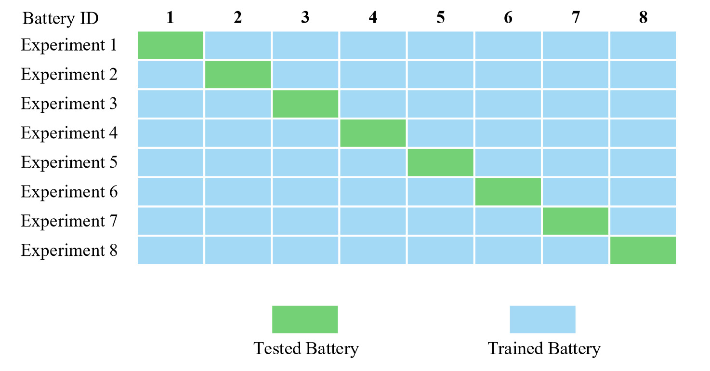

实验结果：

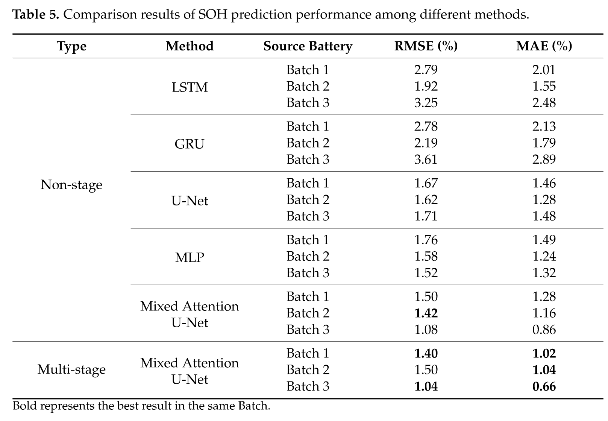

Wang et al. (2024b)

[Wang J, Li H, Wu C, et al. State of Health Estimations for Lithium-Ion Batteries Based on MSCNN[J]. Energies, 2024, 17(17): 4220.](https://doi.org/10.3390/en17174220)

文章从充电数据中提取了8个特征，分别为：
`恒流充电时间`、`恒压充电时间`、`平均充电电压`、`平均充电电流`、`充电电压标准差`、
`充电电流偏度`、`充电电压偏度`、`充电电压峰度`。
分了3种模式来验证模型性能。

**注意**：下面表格中的记法`Group A`等效于上文定义的`B1`;
`Group B`等效于上文定义的`B2`。

---

**模式1：同一批次训练和测试**
训练集和测试集划分方式：

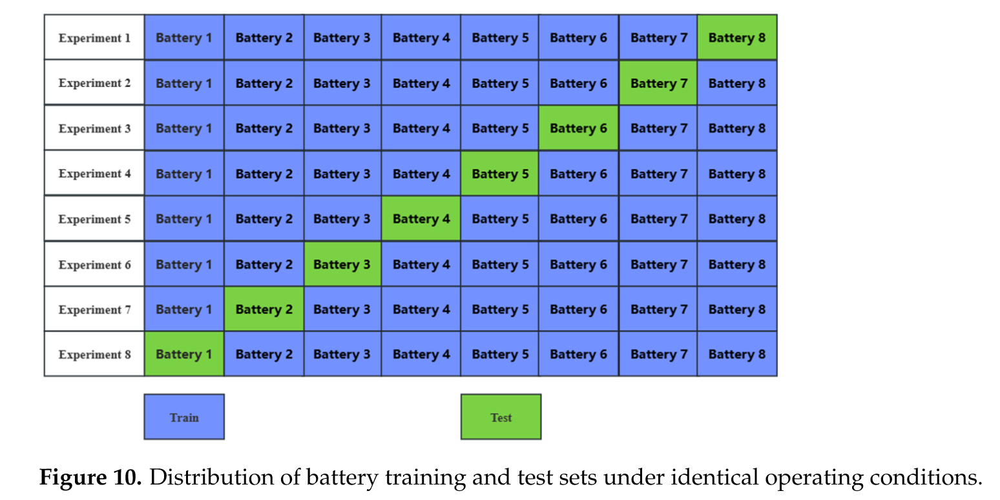

Batch-1数据集上的结果（表格中的`Group A 1` = `B1b1`） ：

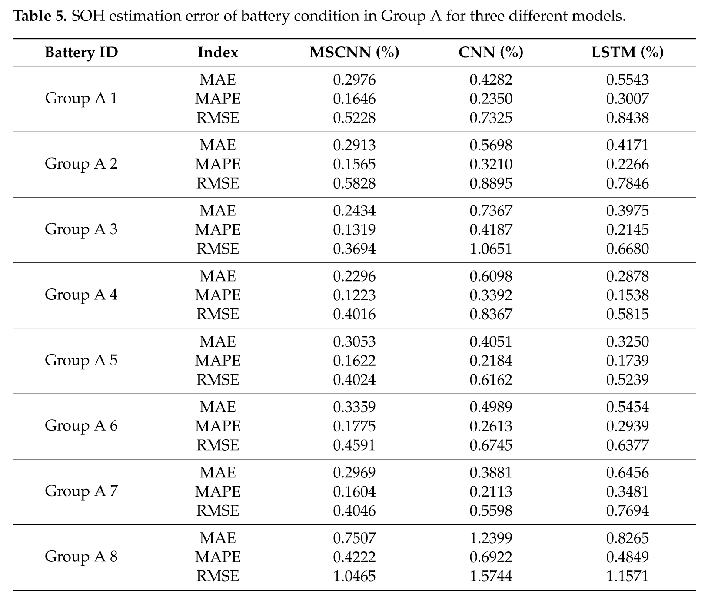

Batch-2数据集上的结果（文章选择了Batch-2中的编号为奇数的电池，所以`Group B x` = `B2b(2x-1)`）：

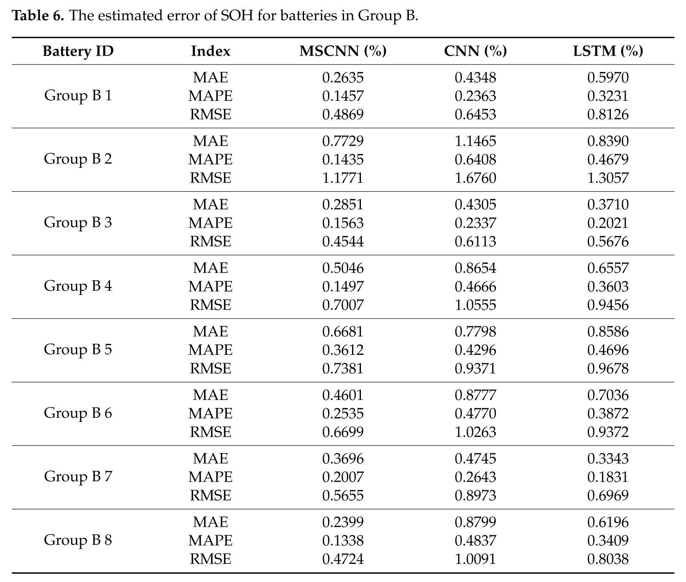

---

**模式2：改变训练集的大小**
训练集和测试集划分方式：

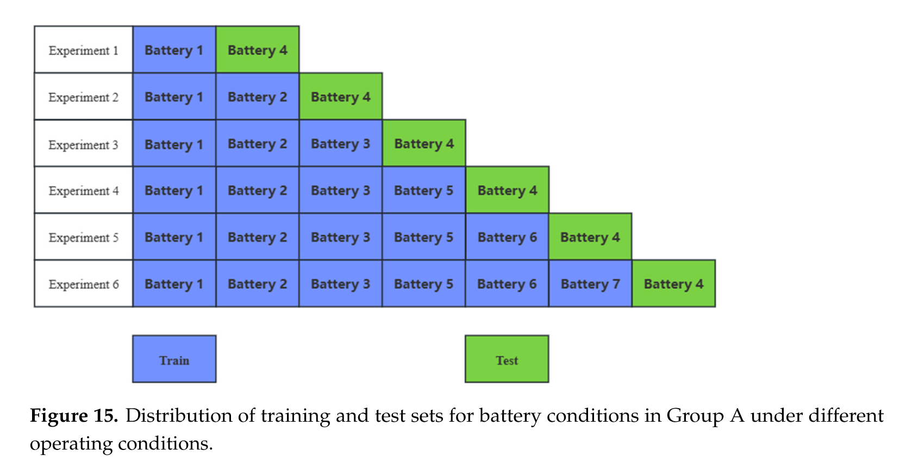

实验结果：

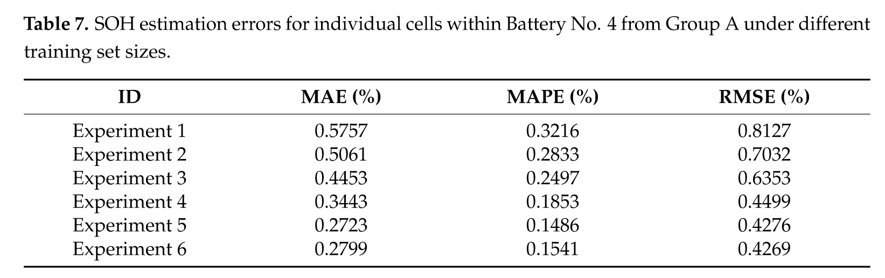

---

**模式3：两个批次混合训练和测试**
训练集和测试集划分方式：

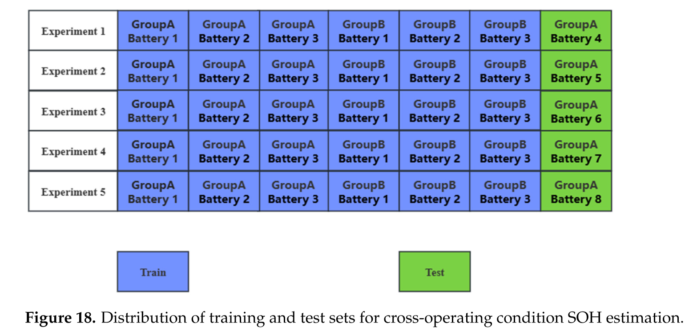

实验结果：

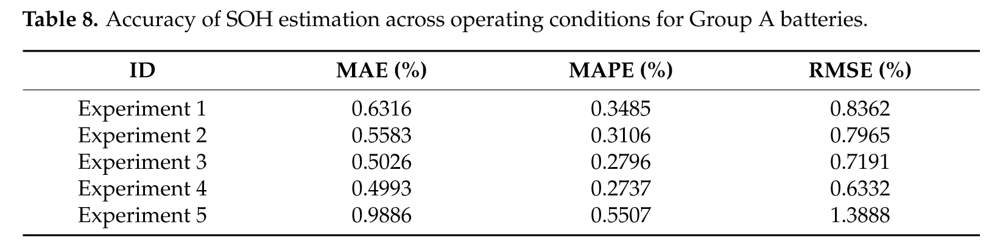

Wang et al. (2024c)

[Wang Z, Zhao Z, Zhou M, et al. Online Capacity Prediction of Lithium-Ion Batteries Based on Physics-Constrained Zonotopic Kalman Filter[J]. IEEE Transactions on Reliability, 2024.](https://ieeexplore.ieee.org/document/10672556)

文章使用了Batch-2的3个电池数据，分别为：`B2b1`、`B2b4`、`B2b5`。

训练和测试的模式为`AA`,即用早期的数据训练，后期的数据测试。

构造了 $T_1$ 至 $T_2$ 期间的`平均充电电流`（ACC）作为间接HI来预测电池容量。

**结果可视化**：

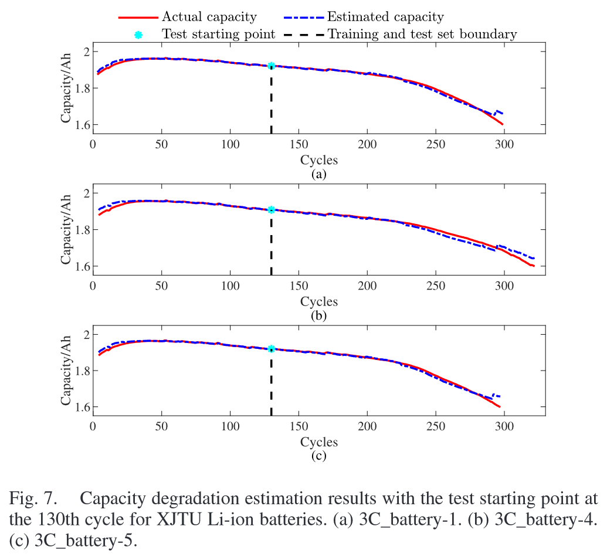

文章分别测试了**不同预测起点**的结果：（表头分别为：`battery`, `Cycle`, `MAE`, `RMSE`, `R2`）

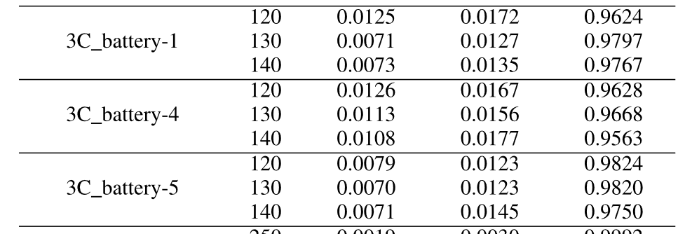

文章给出的与其他**方法对比**的结果如下：

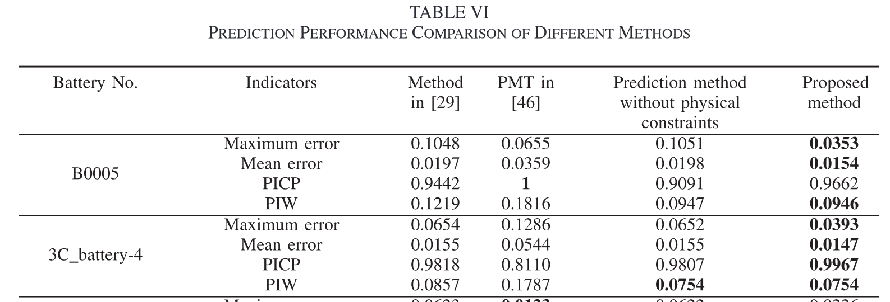

---

# RUL prediction

