# 用了XJTU battery dataset的文章统计和整理

> [!NOTE]
> **目的**：本文件统计和整理了使用XJTU battery dataset的文章，并详细记录了该文章中的结果，便于其他文章在使用该数据集时可以直接搬运这里的结果对比。

English document: [English](./README.md)

最近更新🕒：2026-3-12 😀😀😀 （**太多了，慢慢更新，整理也挺费时间的，争取一天一篇。如果作者有时间总结自己的文章，可以联系我或者直接推送**）

**数据集链接：**
- [GitHub](https://wang-fujin.github.io/)
- 

**数据说明和预处理代码：**
https://github.com/wang-fujin/Battery-dataset-preprocessing-code-library

**如果你使用了该数据集，请引用我们的文章：**

[Wang F, Zhai Z, Zhao Z, et al. Physics-informed neural network for lithium-ion battery degradation stable modeling and prognosis[J]. Nature Communications, 2024, 15(1): 4332.](https://www.nature.com/articles/s41467-024-48779-z)

## 数据汇总

> [!IMPORTANT]
> XJTU battery dataset一共包含6个Batch，共55只电池。并非所有文章都会用到所有电池，所以这里定义了一个缩写来表示文章用了哪些电池，格式为`Bxby`。
> - `Bx`表示第 x 个Batch；
> - `by`表示该Batch的第 y 只电池;
> - `All`表示所有电池。
> 
> 例如:
> - `B1b1`表示第1个Batch的第1只电池;
> - `B1`表示第1个Batch的所有电池;
> - `B2b1-b4`表示第2个Batch的第1到第4只电池;

> [!IMPORTANT]
> 我们把文章的训练和测试模式(Mode)分为两种：
> - 第一种：在同一个电池上训练和测试，用早期的数据训练，后期的数据测试，该模式记为`Train A and Test A`，简称为`AA`；
> - 第二种：在不同电池上训练和测试，该模式记为`Train A and Test B`，简称为`AB`；

---

### SOH估计结果汇总
| Battery |         Model Name         | Mode |    MSE    |  RMSE   |  MAE   |  MAPE   | R2 |              Details              |                                                           Paper Link                                                           | Non-transfer learning | Transfer learning |
|:-------:|:--------------------------:|:----:|:---------:|:-------:|:------:|:-------:|:-------------:|:---------------------------------:|:------------------------------------------------------------------------------------------------------------------------------:|:-----:|:-----:|
| `B1b1`  |        HHO-LSTM-FC         | `AA` |     -     | 0.0078  | 0.0065 |    -    |    0.9422     |  [Yang et al. (2024)](#yang2024)  |                                       [link](https://www.mdpi.com/2071-1050/16/15/6316)                                        | ✅ | ✅  |
|  `All`  |          CNN[^1]           | `AB` | 0.000161  |    -    | 0.0085 | 0.00926 |    0.9187     | [Wang et al. (2024a)](#wang2024a) |                     [link](https://www.sciencedirect.com/science/article/pii/S2352152X23032826?via%3Dihub)                     | ✅ | ❌  |
|  `All`  |          LSTM[^1]          | `AB` | 0.000117  |    -    | 0.0079 | 0.00861 |    0.9407     | [Wang et al. (2024a)](#wang2024a) |                     [link](https://www.sciencedirect.com/science/article/pii/S2352152X23032826?via%3Dihub)                     | ✅ | ❌  |
|  `All`  |          GRU[^1]           | `AB` | 0.0000983 |    -    | 0.0071 | 0.00776 |    0.9503     | [Wang et al. (2024a)](#wang2024a) |                     [link](https://www.sciencedirect.com/science/article/pii/S2352152X23032826?via%3Dihub)                     | ✅ | ❌  |
|  `All`  |          MLP[^1]           | `AB` | 0.000139  |    -    | 0.0078 | 0.00844 |    0.9331     | [Wang et al. (2024a)](#wang2024a) |                     [link](https://www.sciencedirect.com/science/article/pii/S2352152X23032826?via%3Dihub)                     | ✅ | ❌  |
|  `All`  |       Attention[^1]        | `AB` | 0.000135  |    -    | 0.0087 | 0.00950 |    0.9317     | [Wang et al. (2024a)](#wang2024a) |                     [link](https://www.sciencedirect.com/science/article/pii/S2352152X23032826?via%3Dihub)                     | ✅ | ❌  |
|  `B1`   |          MMAU-Net          | `AB` |     -     |  1.40%  | 1.02%  |    -    |       -       |  [Fan et al. (2024a)](#fan2024a)  |                                       [link](https://www.mdpi.com/2079-9292/13/16/3244)                                        | ✅ | ❌  |
|  `B2`   |          MMAU-Net          | `AB` |     -     |  1.50%  | 1.04%  |    -    |       -       |  [Fan et al. (2024a)](#fan2024a)  |                                       [link](https://www.mdpi.com/2079-9292/13/16/3244)                                        | ✅ | ❌  |
|  `B3`   |          MMAU-Net          | `AB` |     -     |  1.04%  | 0.66%  |    -    |       -       |  [Fan et al. (2024a)](#fan2024a)  |                                       [link](https://www.mdpi.com/2079-9292/13/16/3244)                                        | ✅ | ❌  |
| `B1-B2` |         MSCNN[^1]          | `AB` |     -     |  0.74%  | 0.67%  |  0.37%  |       -       | [Wang et al. (2024b)](#wang2024b) |                                           [link](https://doi.org/10.3390/en17174220)                                           | ✅ | ❌  |
| `B2b1`  |            ZKF             | `AA` |     -     | 0.0172  | 0.0125 |    -    |    0.9624     | [Wang et al. (2024c)](#wang2024c) |                 [link](https://ieeexplore.ieee.org/document/10672556)                  | ✅ | ❌  |
| `B2b4`  |            ZKF             | `AA` |     -     | 0.0167  | 0.0126 |    -    |    0.9628     | [Wang et al. (2024c)](#wang2024c) |                 [link](https://ieeexplore.ieee.org/document/10672556)                  | ✅ | ❌  |
| `B2b5`  |            ZKF             | `AA` |     -     | 0.0123  | 0.0079 |    -    |    0.9824     | [Wang et al. (2024c)](#wang2024c) |                 [link](https://ieeexplore.ieee.org/document/10672556)                  | ✅ | ❌  |
| `B1-B3` |         MSFDTN[^1]         | `AB` |   0.22%   |    -    | 3.93%  |    -    |    0.9533     | [Wang et al. (2024d)](#wang2024d) |                 [link](https://doi.org/10.1016/j.est.2024.114286)                 |          ❌          |        ✅        |
| `B1-B3` |         DR-Net[^1]         | `AB` |   1.92%   |    -    | 10.49% |    -    |       -       | [Wang et al. (2024d)](#wang2024d) |                 [link](https://doi.org/10.1016/j.est.2024.114286)                 |          ❌          |        ✅        |
| `B1-B3` |         AttMoE[^1]         | `AB` |   2.43%   |    -    | 10.63% |    -    |       -       | [Wang et al. (2024d)](#wang2024d) |                 [link](https://doi.org/10.1016/j.est.2024.114286)                 |          ❌          |        ✅        |
| `B1-B3` |         ELSTM[^1]          | `AB` |   2.07%   |    -    | 11.20% |    -    |       -       | [Wang et al. (2024d)](#wang2024d) |                 [link](https://doi.org/10.1016/j.est.2024.114286)                 |          ❌          |        ✅        |
| `B1-B3` |          MMMe[^1]          | `AB` |   5.53%   |    -    | 18.60% |    -    |       -       | [Wang et al. (2024d)](#wang2024d) |                 [link](https://doi.org/10.1016/j.est.2024.114286)                 |          ❌          |        ✅        |
| `B1-B3` |  PVA-FFG-Transformer[^1]   | `AB` |   6.11%   |    -    | 21.50% |    -    |       -       | [Wang et al. (2024d)](#wang2024d) |                 [link](https://doi.org/10.1016/j.est.2024.114286)                 |          ❌          |        ✅        |
|  `B1`   |       GJO-SNuSVR[^1]       | `AB` |     -     | 0.0048  |   -    | 0.0041  |       -       | [Liu  et al. (2025a)](#liu2025a)  | [link](https://doi.org/10.1016/j.est.2024.114822) |          ✅         |       ❌         |
|  `B2`   |         EVO-LSSVM          | `AB` |     -     | 0.4939% |   -    |    -    |    0.9915     | [Liu  et al. (2025b)](#liu2025b)  | [link](https://doi.org/10.1016/j.measurement.2024.116620) |          ✅         |       ❌         |
|  `B3`   |         EVO-LSSVM          | `AB` |     -     | 0.4018% |   -    |    -    |    0.9947     | [Liu  et al. (2025b)](#liu2025b)  | [link](https://doi.org/10.1016/j.measurement.2024.116620) |          ✅         |       ❌         |
| `B1b3`  |      BiGRU-Attention       | `AA` |     -     | 0.8611  | 0.6522 |    -    |       -       |  [Sun et al. (2025a)](#sun2025a)  | [link](https://doi.org/10.1016/j.energy.2025.134756) |          ✅         |       ❌         |
|  `B1`   |      BatteryPINN [^1]      | `AB` |     -     | 0.5671% |   -    | 0.3443% |       -       |  [Liu et al. (2025c)](#liu2025c)  | [link](https://doi.org/10.1016/j.aei.2025.103211) |          ✅         |       ❌         |
|  `B2`   |      BatteryPINN [^1]      | `AB` |     -     | 0.2900% |   -    | 0.2014% |       -       |  [Liu et al. (2025c)](#liu2025c)  | [link](https://doi.org/10.1016/j.aei.2025.103211) |          ✅         |       ❌         |
|  `B3`   |      BatteryPINN [^1]      | `AB` |     -     | 0.7193% |   -    | 0.5817% |       -       |  [Liu et al. (2025c)](#liu2025c)  | [link](https://doi.org/10.1016/j.aei.2025.103211) |          ✅         |       ❌         |
|`B1b1`、`B1b6`、`B2b2`| - | `AA` |  <0.07%   | <2.67%  | <1.61% | - | - |   [He et al. (2025a)](#he2025a)   | [link](https://doi.org/10.1016/j.est.2025.116820) |          ✅         |       ❌         |
|`B1b1-B1b4` | PI-TFT-iDOA | `AA` |     -     |   见详情    |   见详情    |   -    |       见详情       |   [Hu et al. (2025a)](#hu2025a)   | [link](https://doi.org/10.1016/j.energy.2025.138239) |          ✅         |       ❌         |
| `All` | GRU | `AB` | - | 0.0254 | - | 0.0234 | 0.9718 | [Coronado et al. (2025a)](#Coronado2025a) | [link](https://doi.org/10.1109/INTERCON67304.2025.11244713) | ✅         |       ❌         |
| `B1b1-b4` | KAN | `AB` |  - | <0.0052 | <0.0043 | - | - | [Jia et al. (2025a)](#Jia2025a) | [link](https://ieeexplore.ieee.org/document/10922385/) | ✅ |  ❌ |
| `B1` | HSSTT | `AB` | - | 1.638% | 1.285% | - | - | [Lin et al. (2025a)](#Lin2025a) | [link](https://ieeexplore.ieee.org/document/11126537) |  ✅ |  ❌ |
| `B1b1-b4`,`B2b1、b3`| CNN | `AB` | - | 见详情 | - | 见详情 | - | [Zhao et al. (2025a)](#Zhao2025a) | [link](https://doi.org/10.1016/j.est.2025.117296) | ✅ | ✅  |
| `B1b1-b6` | MLPS | `AB` | - | 0.3868% | 0.2531% | 0.2771% | 0.9946 | [Liu et al. (2026a)](#Liu2026a) | [link](https://doi.org/10.1016/j.est.2025.119595) | ✅ |  ❌ |
| `B1` | KG-CNN | `AB` | - | 42.53 mAh | - | - | - | [Zhang et al. (2025a)](#Zhang2025a) | [link](https://doi.org/10.1016/j.ress.2025.111211) | ✅ |  ❌ |
| `B1` | RATGH | `AB` | - | <1.14% | <0.655% | <0.598% |  >0.9643 | [Chen et al. (2026a)](#Chen2026a) | [link](https://link.springer.com/article/10.1007/s00202-025-03350-x) | ✅ |  ❌ |
| `B1b1-b3` | FCSA-PatchTSCT | `AB` | - | <0.0057 | <0.0047 | - | >0.9882 | [Gui et al. (2026a)](#Gui2026a) | [link](https://ieeexplore.ieee.org/document/11265776) | ❌ |  ✅ |
| `All` | FourierKAN | `AB` | - | 1.0765% | 0.84234% | 0.91732% | - | [He et al. (2025b)](#He2025b) | [link](https://ieeexplore.ieee.org/document/11278989) | ✅ |  ❌ |
| `All` | EFATransformer | `AB` | - | 0.4101% | 0.266% | 0.296% | - | [Huang et al. (2025a)](#Huang2025a) | [link](https://ieeexplore.ieee.org/document/11244181) | ✅ |  ❌ |
| `B1-B2` | GAT-LSTM | `AB` | - | <0.23% | <0.11% | <0.12%| >0.9972 | [Gao et al. (2025a)](#Gao2025a) | [link](https://ieeexplore.ieee.org/document/11384461) |✅ |  ❌ |
| `B2` | xLSTM | `AB` | - | 0.27% | - | 0.19% | 0.996 | [Meng et al. (2025a)](#Meng2025a) | [link](https://doi.org/10.1016/j.ijepes.2025.111146) |✅ |  ❌ |
| `B1b1`,`B3b1`,`B4b1`,`B5b1` | MBLSTM+iTransformer | - | 见详情 | 见详情 | 见详情 | - | 见详情 | [Guo et al. (2025a)](#Guo2025a) | [link](https://ieeexplore.ieee.org/document/11217227) |✅ |  ❌ |

[^1]: 表格中的MSE，RMSE，MAE，MAPE都是所有电池的平均值。

---

### RUL预测结果汇总
| Battery |   Model Name   | Mode |    MSE     |  RMSE   |  MAE   |    MAPE     | R2 |             Details             |            Paper Link             | Non-transfer learning | Transfer learning |
|:-------:|:--------------:|:----:|:----------:|:-------:|:------:|:-----------:|:-------------:|:-------------------------------:|:---------------------------------:|:-----:|:-----:|
|`B1,B3-B5`| ShuffleNet | `AB` |  - | - | - | - | - | [Feng et al. (2025a)](#feng2025a) | [link](https://doi.org/10.1016/j.est.2025.116210) |          ✅          |        ❌        |
| `B1-B2` | AlexNet | `AB` | - | 24.04[^2] | - | 7.86% | - | [Yang et al. (2025a)](#Yang2025a) | [link](https://doi.org/10.1016/j.jpowsour.2025.236620) | ✅  | ❌ |
| `B1,B3` | ECA-CNN | `AB` | - | - | - | - | - | [Li et al. (2025a)](#Li2025a) | [link](https://ieeexplore.ieee.org/document/11268112) | ✅  | ❌ | 
| `B1,B2,B6` | ACCSE | `AB` | - | 69 | 55 | 10.05% | 0.96 | [Bi et al. (2026a)](#Bi2026a) | [link](https://doi.org/10.1016/j.apenergy.2026.127515) | ✅  | ❌ | 

[^2]: 单位为cycle。

---

### V-Q 曲线预测结果汇总

| Battery | Model Name | Mode |    MSE     |    RMSE     |  MAE   |    MAPE     | R2 |              Details              | Paper Link | Non-transfer learning | Transfer learning |
|:-------:|:----------:|:----:|:----------:|:-----------:|:------:|:-----------:|:-------------:|:---------------------------------:|:-----:|:-----:|:-----:|
| `B1b2`  |    PINN    | `AB` |  -  |  14.86e-3   |  -  |  -  | - | [Tang et al. (2024a)](#tang2024a) | [link](https://doi.org/10.1016/j.jechem.2024.10.018) |          ✅          |        ❌        |
| `B1b8`  |    PINN    | `AB` |  -  |  22.04e-3   |  -  |  -  | - | [Tang et al. (2024a)](#tang2024a) | [link](https://doi.org/10.1016/j.jechem.2024.10.018) |          ✅          |        ❌        |
| `B2b2`  |    PINN    | `AB` |  -  |  40.95e-3   |  -  |  -  | - | [Tang et al. (2024a)](#tang2024a) | [link](https://doi.org/10.1016/j.jechem.2024.10.018) |          ✅          |        ❌        |
| `B2b8`  |    PINN    | `AB` |  -  |  37.70e-3   |  -  |  -  | - | [Tang et al. (2024a)](#tang2024a) | [link](https://doi.org/10.1016/j.jechem.2024.10.018) |          ✅          |        ❌        |
|  `B1`   |     -      | `AB` |  -  | 0.046 (max) |  -  |  -  | - | [Tang et al. (2024b)](#tang2024b) | [link](https://doi.org/10.1016/j.etran.2024.100378) |          ✅          |        ❌        |
|  `B2`   |     -      | `AB` |  -  | 0.055 (max) |  -  |  -  | - | [Tang et al. (2024b)](#tang2024b) | [link](https://doi.org/10.1016/j.etran.2024.100378) |          ✅          |        ❌        |

---
### SOC预测结果汇总
| Battery | Model Name | Mode |    MSE     | RMSE  |  MAE  | MAPE  | R2 |              Details              | Paper Link | Non-transfer learning | Transfer learning |
|:-------:|:----------:|:----:|:----------:|:-----:|:-----:|:-----:|:-------------:|:---------------------------------:|:-----:|:-----:|:-----:|
| `B1` |    TFN     | `AB` |  -  | 0.78% | 0.61% | 2.70% | - | [Wang et al. (2025a)](#wang2025a) | [link](https://doi.org/10.1016/j.energy.2025.134722) |          ✅          |        ❌        |
|`B3` |    TFN     | `AB` |  -  | 2.27% | 1.90% | 5.47% | - | [Wang et al. (2025a)](#wang2025a) | [link](https://doi.org/10.1016/j.energy.2025.134722) |          ✅          |        ❌        |

---

# SOH estimation

 

Yang et al. (2024)

[Yang G, Wang X, Li R, et al. State of Health Estimation for Lithium-Ion Batteries Based on Transferable Long Short-Term Memory Optimized Using Harris Hawk Algorithm[J]. Sustainability, 2024, 16(15): 6316.](https://www.mdpi.com/2071-1050/16/15/6316)

只用了Batch-1的第1个电池，记为`B1b1`。

文章实现了两种SOH估计模式：
1. 在NASA的B6和B7电池上预训练，然后用B1b1前30%的数据微调，然后再B1b1上测试；
2. 用B1b1的前70%的数据训练，然后在B1b1上测试；

结果：

|                    | RMSE   | MAE    | R2     | 模式  |
| ------------------ | ------ | ------ | ------ | --- |
| HHO-LSTM-FC-TL(B6) | 0.0037 | 0.0029 | 0.9941 | 1   |
| HHO-LSTM-FC-TL(B7) | 0.0034 | 0.0027 | 0.9952 | 1   |
| HHO-LSTM-FC        | 0.0078 | 0.0065 | 0.9422 | 2   |

Wang et al. (2024a)

[Wang F, Zhai Z, Liu B, et al. Open access dataset, code library and benchmarking deep learning approaches for state-of-health estimation of lithium-ion batteries[J]. Journal of Energy Storage, 2024, 77: 109884.](https://www.sciencedirect.com/science/article/pii/S2352152X23032826?via%3Dihub)

我们在这篇文章中提供了一个benchmark，测试了5个深度学习模型在3种输入类型（`全部充电数据`、`部分充电数据`、`特征`）和3种归一化方式下的结果。

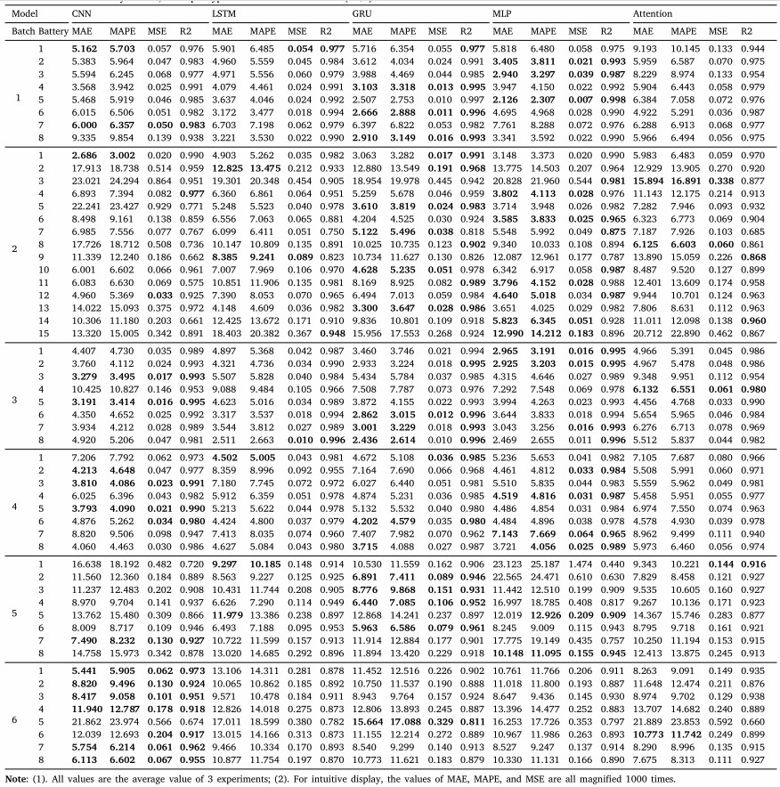

上面的图片是以`特征`作为输入，`[-1,1]归一化`的情况下5个模型的结果，所有结果都被放大了1000倍。
由于结果太多，我们只展示其中一种结果，其他结果可以查看原文。

Fan et al. (2024a)

[Fan X, Yang X, Hou F. Integrated Mixed Attention U-Net Mechanisms with Multi-Stage Division Strategy Customized for Accurate Estimation of Lithium-Ion Battery State of Health[J]. Electronics, 2024, 13(16): 3244.](https://www.mdpi.com/2079-9292/13/16/3244)

文章使用了Batch-1、Batch-2和Batch-3的数据。
模型的输入为原始的电压、电流和温度数据。

训练集和测试集划分方式：

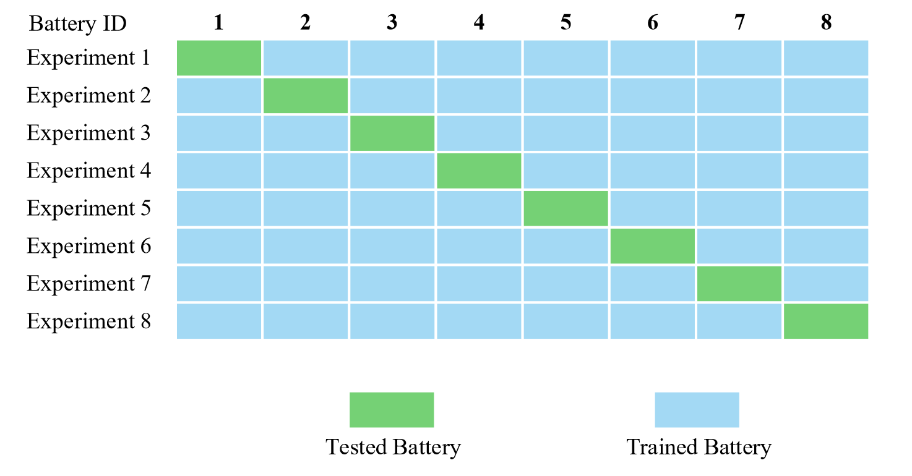

实验结果：

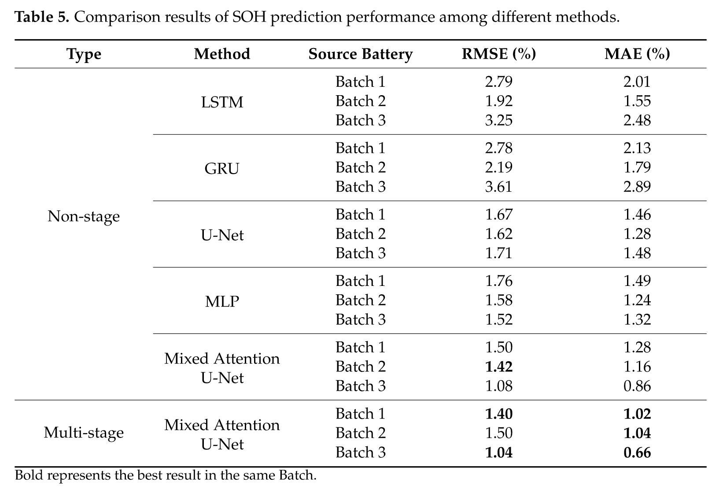

Wang et al. (2024b)

[Wang J, Li H, Wu C, et al. State of Health Estimations for Lithium-Ion Batteries Based on MSCNN[J]. Energies, 2024, 17(17): 4220.](https://doi.org/10.3390/en17174220)

文章从充电数据中提取了8个特征，分别为：
`恒流充电时间`、`恒压充电时间`、`平均充电电压`、`平均充电电流`、`充电电压标准差`、
`充电电流偏度`、`充电电压偏度`、`充电电压峰度`。
分了3种模式来验证模型性能。

**注意**：下面表格中的记法`Group A`等效于上文定义的`B1`;
`Group B`等效于上文定义的`B2`。

---

**模式1：同一批次训练和测试**
训练集和测试集划分方式：

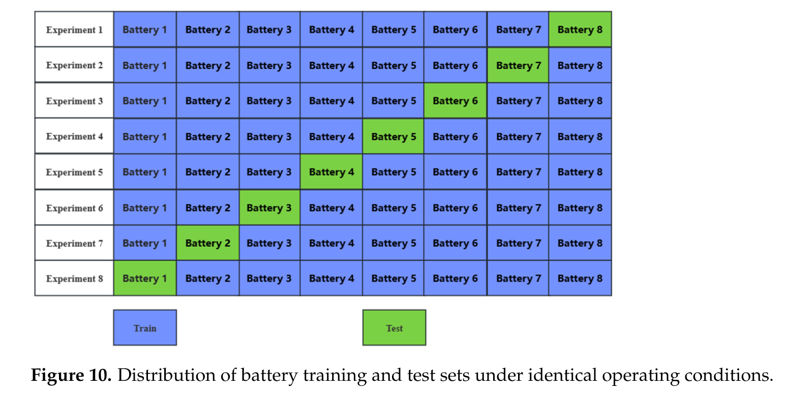

Batch-1数据集上的结果（表格中的`Group A 1` = `B1b1`） ：

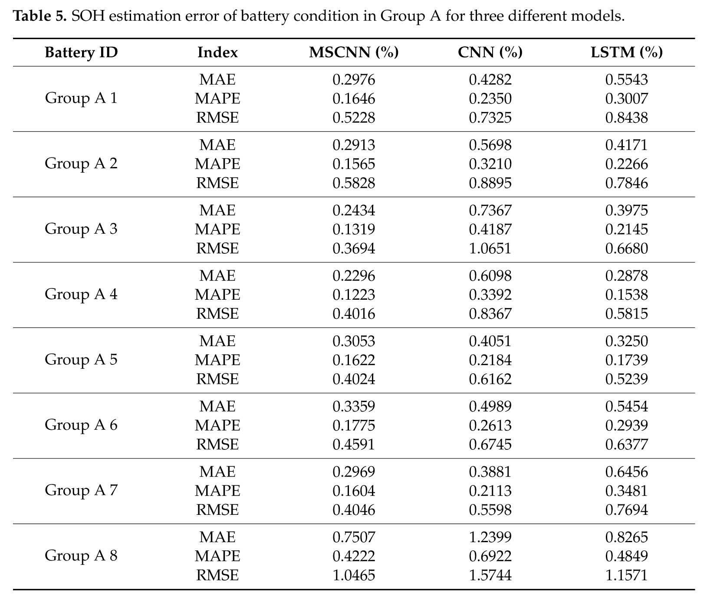

Batch-2数据集上的结果（文章选择了Batch-2中的编号为奇数的电池，所以`Group B x` = `B2b(2x-1)`）：

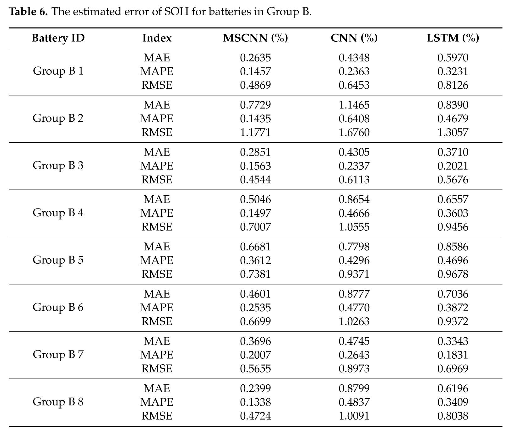

---

**模式2：改变训练集的大小**
训练集和测试集划分方式：

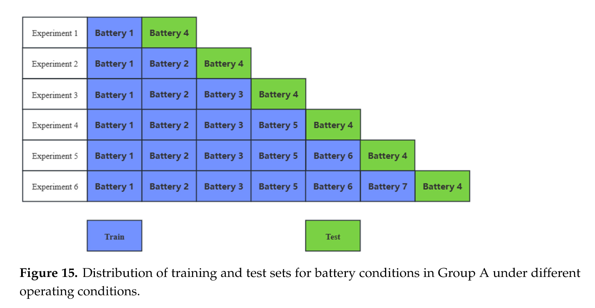

实验结果：

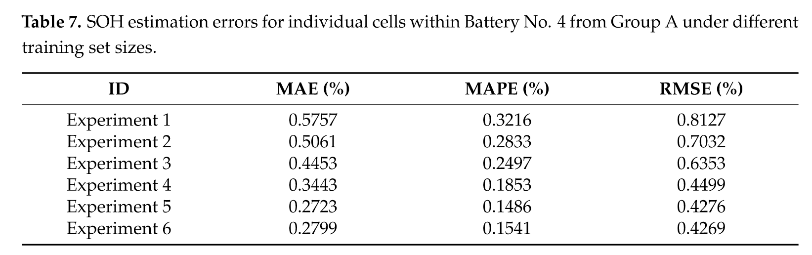

---

**模式3：两个批次混合训练和测试**
训练集和测试集划分方式：

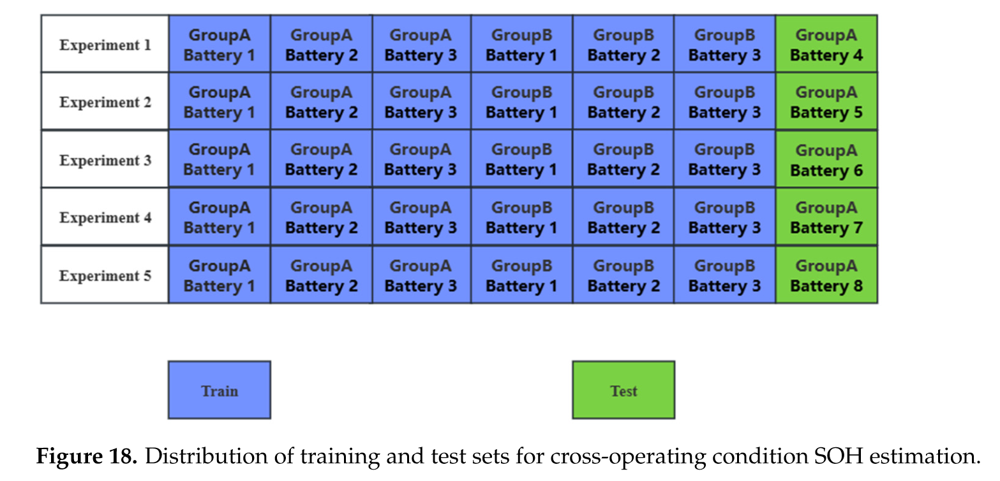

实验结果：

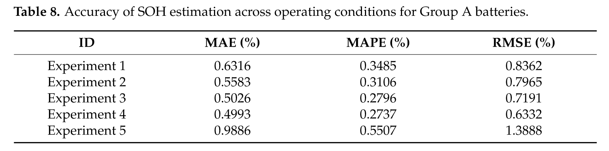

Wang et al. (2024c)

[Wang Z, Zhao Z, Zhou M, et al. Online Capacity Prediction of Lithium-Ion Batteries Based on Physics-Constrained Zonotopic Kalman Filter[J]. IEEE Transactions on Reliability, 2024.](https://ieeexplore.ieee.org/document/10672556)

文章使用了Batch-2的3个电池数据，分别为：`B2b1`、`B2b4`、`B2b5`。

训练和测试的模式为`AA`,即用早期的数据训练，后期的数据测试。

构造了 $T_1$ 至 $T_2$ 期间的`平均充电电流`（ACC）作为间接HI来预测电池容量。

**结果可视化**：

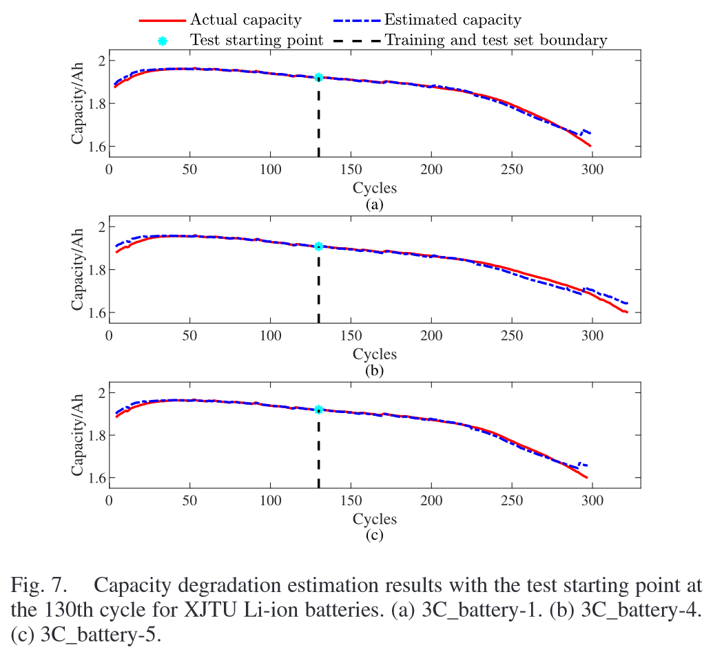

文章分别测试了**不同预测起点**的结果：（表头分别为：`battery`, `Cycle`, `MAE`, `RMSE`, `R2`）

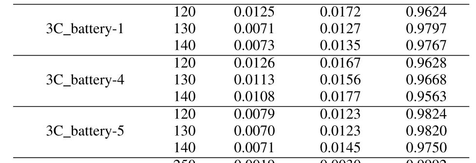

文章给出的与其他**方法对比**的结果如下：

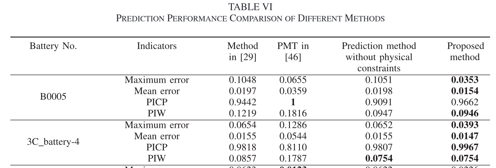

Wang et al. (2024d)

[Wang C, Wu J, Yang Y, et al. Multi-scale self-attention feature decoupling transfer network-based cross-domain capacity prediction of lithium-ion batteries[J]. Journal of Energy Storage, 2024, 103: 114286.](https://doi.org/10.1016/j.est.2024.114286)

文章使用了Batch-1、Batch-2的前8个和Batch-3的电池数据来验证提出的方法，分别为：`B1-B3`。
任务是使用迁移学习方法来预测电池的`容量`；
3个Batch分别表示3个域，文中表示为D1、D2、D3。

**结果可视化**：

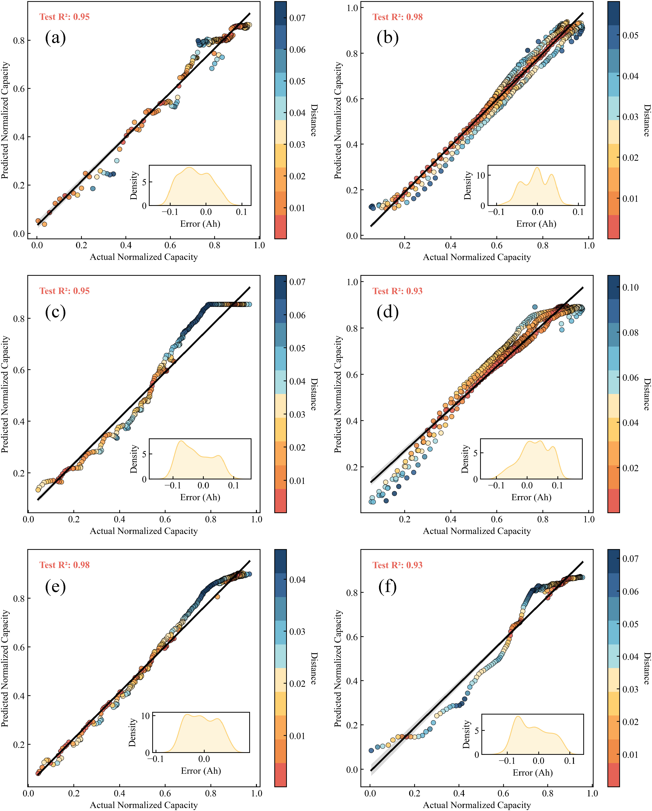

文章给出的与其他**方法对比**的结果如下：

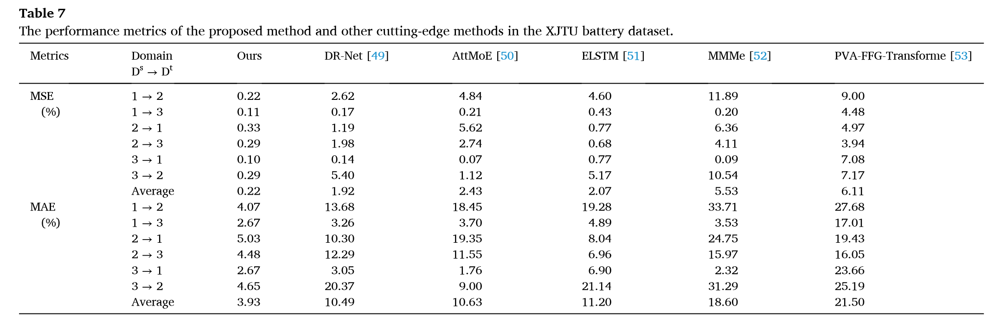

Liu et al. (2025a)

[Liu Y, Ding J, Cai Y, et al. A battery SOH estimation method based on entropy domain features and semi-supervised learning under limited sample conditions[J]. Journal of Energy Storage, 2025, 106: 114822.](https://doi.org/10.1016/j.est.2024.114822)

文章使用了Batch-1的前7个电池数据来验证提出的GJO-SNuSVR方法；
任务是SOH估计；

**结果可视化**：

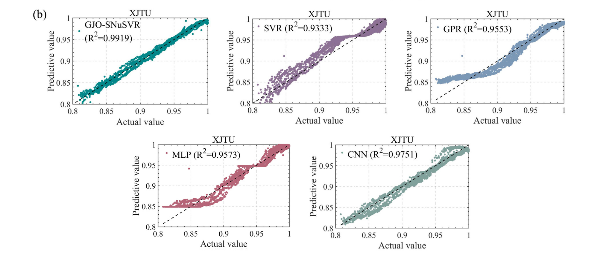

文章给出的与其他**方法对比**的结果如下：

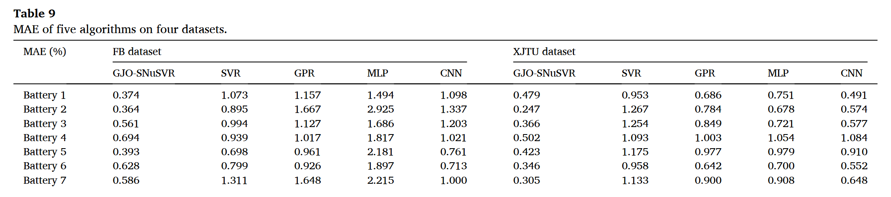

Liu et al. (2025b)

[Liu Y, Ding J, Yao L, et al. A novel high-accuracy intelligent estimation method for battery state of health[J]. Measurement, 2025, 245: 116620.](https://doi.org/10.1016/j.measurement.2024.116620)

文章使用了Batch-1的数据来训练提出的EVO_LSSVM模型，在Batch-2和Batch3数据上进行测试；
任务是SOH估计；

**结果可视化**：

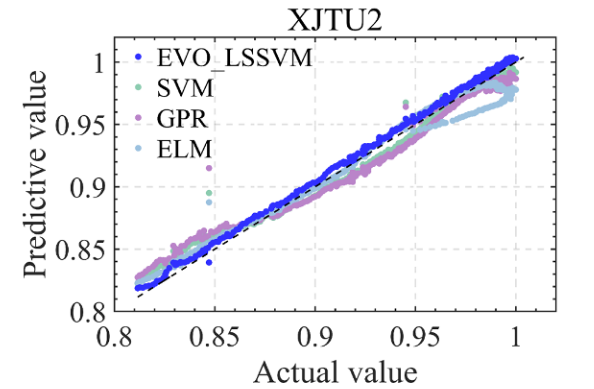
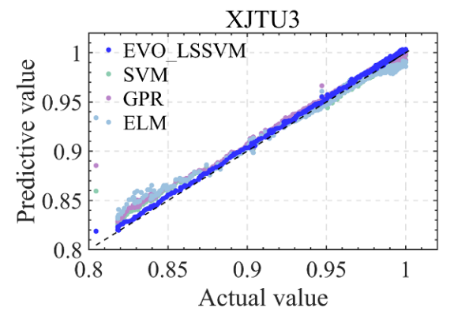

文章给出的与其他**方法对比**的结果如下：

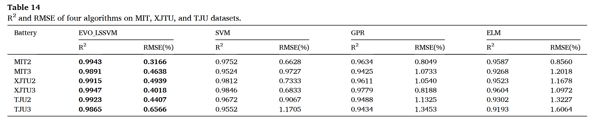

Sun et al. (2025a)

[Sun R, Chen J, Li B, et al. State of health estimation for Lithium-ion batteries based on novel feature extraction and BiGRU-Attention model[J]. Energy, 2025: 134756.](https://doi.org/10.1016/j.energy.2025.134756)

文章使用了Batch-1的第3个电池数据来验证提出的BiGRU-Attention模型，记为`B1b3`；
任务是SOH估计；

数据划分方式为`AA`，即用早期的数据训练，后期的数据测试；

文章进行了两种划分：60%的训练集和40%的测试集，70%的训练集和30%的测试集。

**结果可视化**：

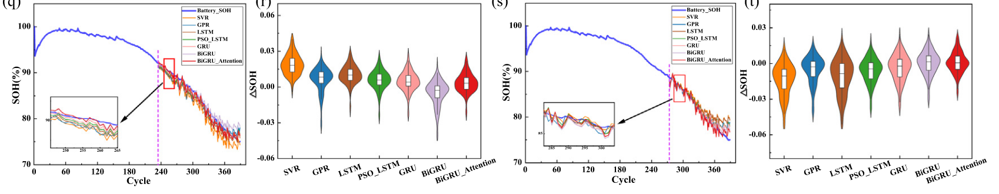

文章给出的与其他**方法对比**的结果如下：

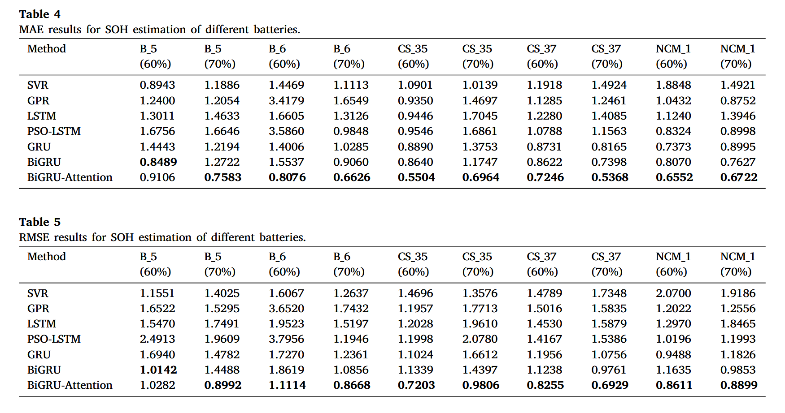

Liu et al. (2025c)

[Liu Y, Chen H, Yao L, et al. A physics-guided approach for accurate battery SOH estimation using RCMHCRE and BatteryPINN[J]. Advanced Engineering Informatics, 2025, 65: 103211.](https://doi.org/10.1016/j.aei.2025.103211)

文章使用了Batch-1到Batch-3的数据来验证提出的BatteryPINN方法；
任务是SOH估计；

**结果可视化**：

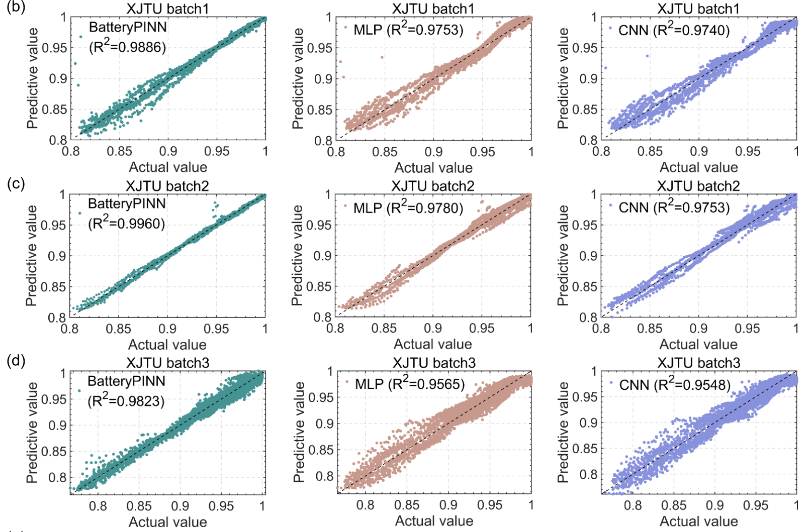

每个电池的单独估计结果：

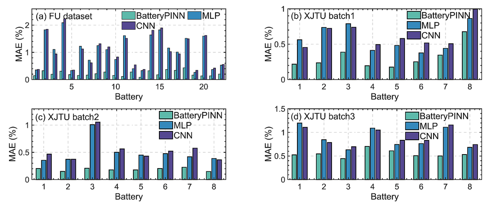

文章给出的与其他**方法对比**的结果如下：

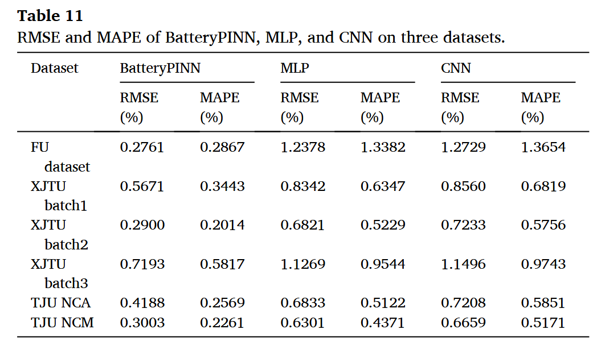

最好和最差结果的MAE：

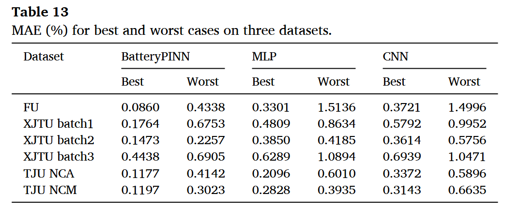

He et al. (2025a)

[He H, Zhang W, Long Z, et al. Prediction of lithium-ion batteries health decline trajectories based on early image features[J]. Journal of Energy Storage, 2025, 124: 116820.](https://doi.org/10.1016/j.est.2025.116820)

文章使用了Batch-1的电池1、6，Batch-2的电池2来验证提出的方法，记为`B1b1`、`B1b6`和`B2b2`；
用前20%的数据进行训练，后80%的数据进行测试。

**结果可视化**：

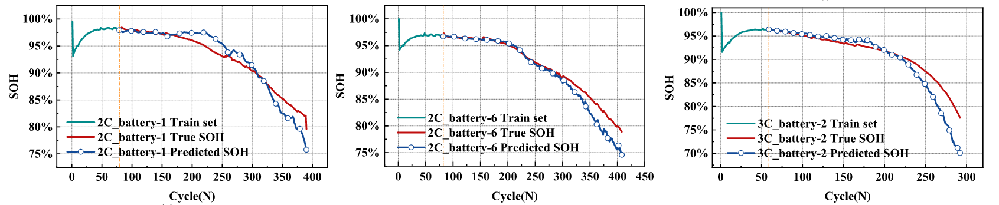

每个电池的单独估计结果：

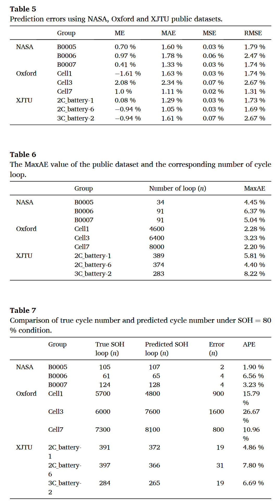

Hu et al. (2025a)

[Hu Y, Yun Z, Wang J, et al. A battery SOH estimation method based on PI-TFT-iDOA driven Li-Battery discharge state features[J]. Energy, 2025: 138239.](https://doi.org/10.1016/j.energy.2025.138239)

文章使用了Batch-1的前4个电池数据来验证提出的方法；

每个电池单独估计结果：

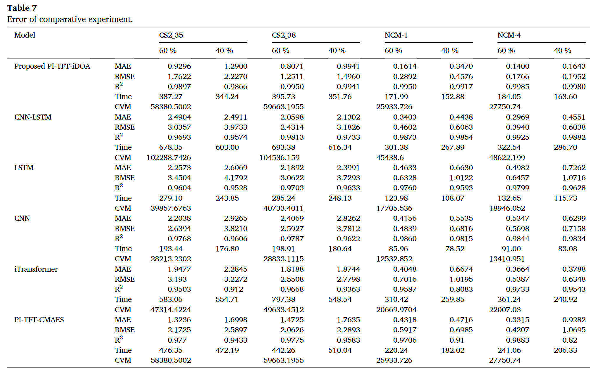

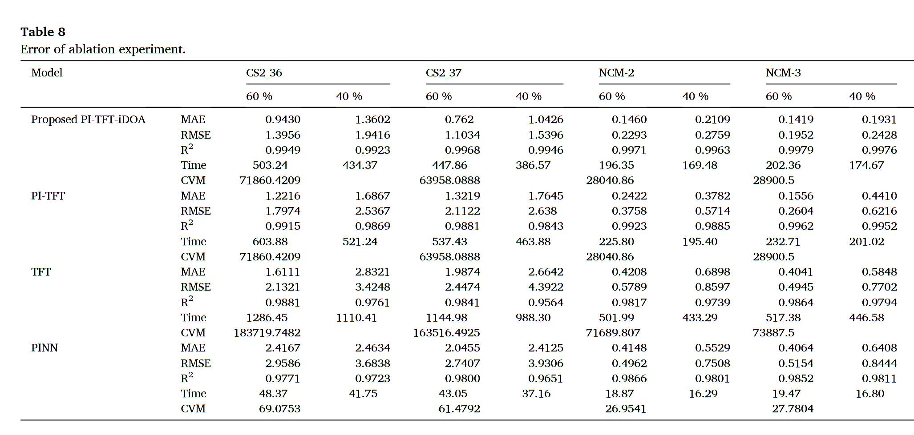

Coronado et al. (2025a)

[Coronado A M, Zegarra F C. Optimizing Neural Networks for SoH Prediction in Li-Ion Batteries: CNN, GRU, and GRU+ Attention with Optuna[C]//2025 IEEE XXXII International Conference on Electronics, Electrical Engineering and Computing (INTERCON). IEEE, 2025: 1-6.](https://doi.org/10.1109/INTERCON67304.2025.11244713)

文章使用6个批次的数据进行混合训练和测试；

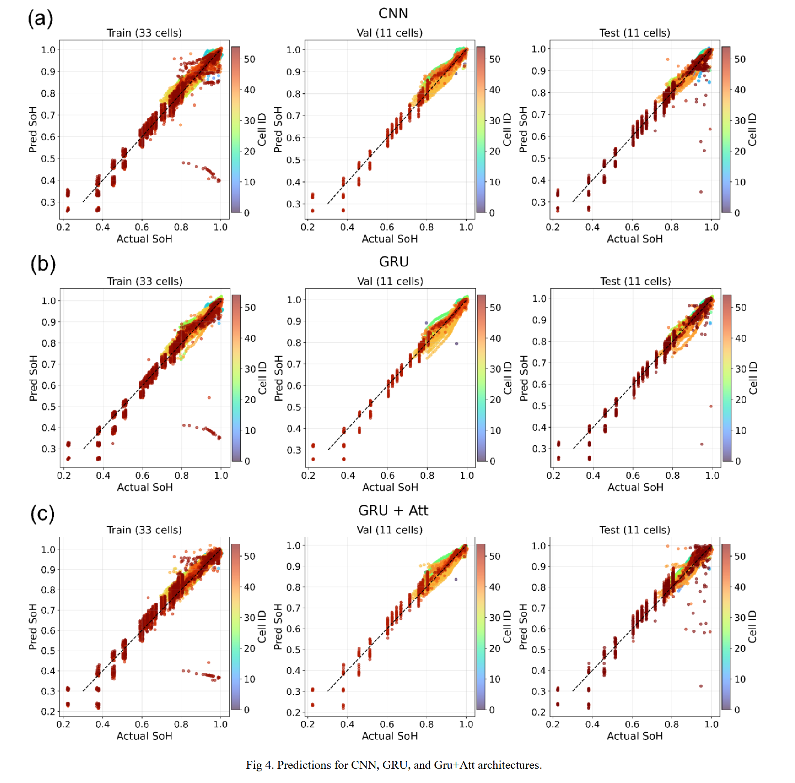

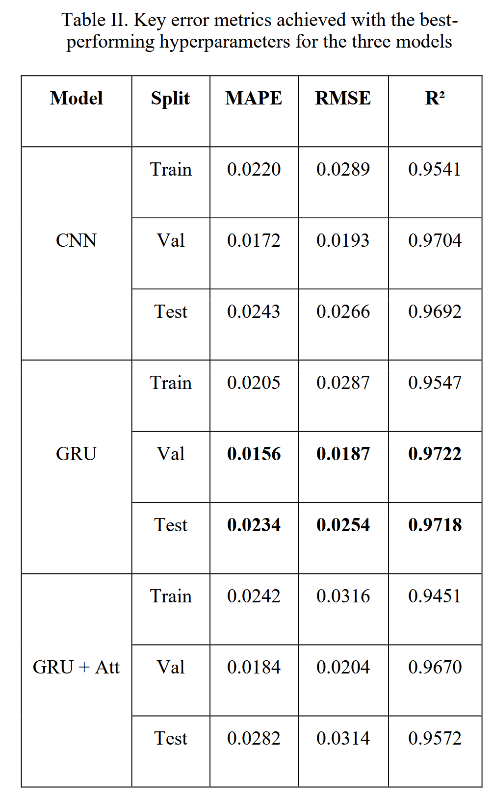

Jia et al. (2025a)

[Z. Jia, Z. Li, Z. Wang, Z. Liu and C. -M. Vong. Joint Prediction of SOH and RUL for Lithium Batteries Considering Capacity Self Recovery and Model Drift[J]. IEEE Internet of Things Journal, vol. 12, no. 12, pp. 22187-22196, 15 June15, 2025](https://ieeexplore.ieee.org/document/10922385)

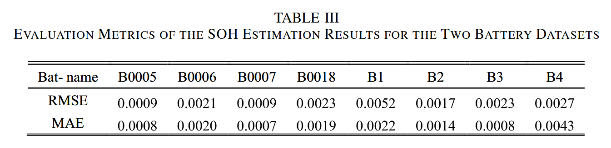

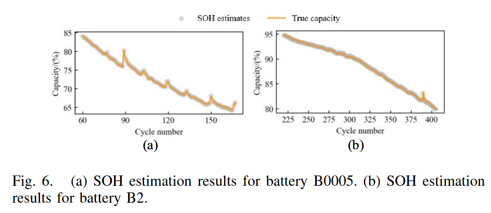

Lin et al. (2025a)

[Lin X, Bi Y, Fu R, et al. Hierarchical Stochastic Spatial–Temporal Transformer for Trustworthy State-of-Health Estimation of Batteries in Industrial Applications[J]. IEEE Transactions on Industrial Informatics, 2025.](https://ieeexplore.ieee.org/document/11126537)

文章提出 HSSTT (Hierarchical Stochastic Spatial–Temporal Transformer) 方法，使用`Batch-1`数据进行验证.

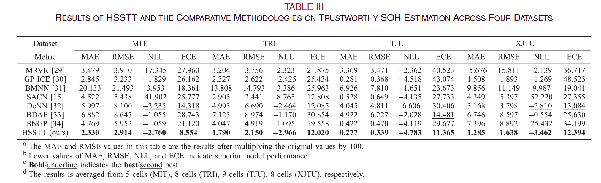

Zhao et al. (2025a)

[Zhao J, Zhang X, Hu C. Lithium-ion battery State-of-Health estimation using voltage-position encoding CNN and Incremental Capacity Analysis with a novel smoothing parameter selection strategy[J]. Journal of Energy Storage, 2025, 130: 117296.](https://doi.org/10.1016/j.est.2025.117296)

文章使用了Batch-1的前4个电池数据和Batch-2的电池1、3的数据来验证提出的方法；有迁移和非迁移两种设定：

**非迁移设定**:文章给出了不同采样间隔下的最大误差值

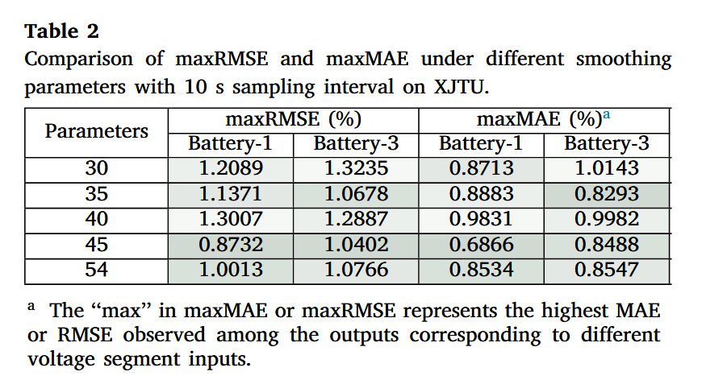

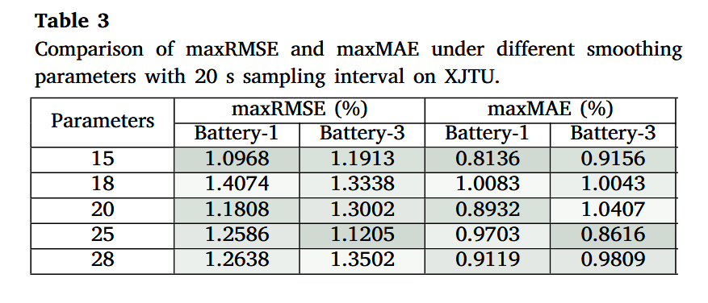

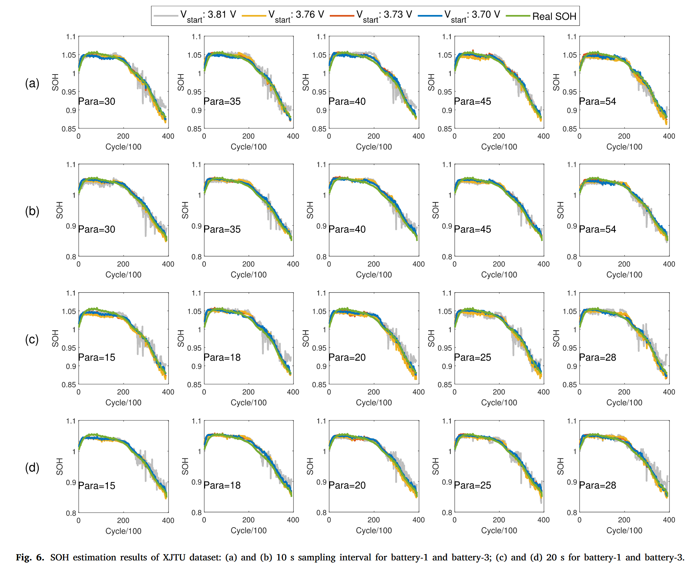

与其他方法的对比：

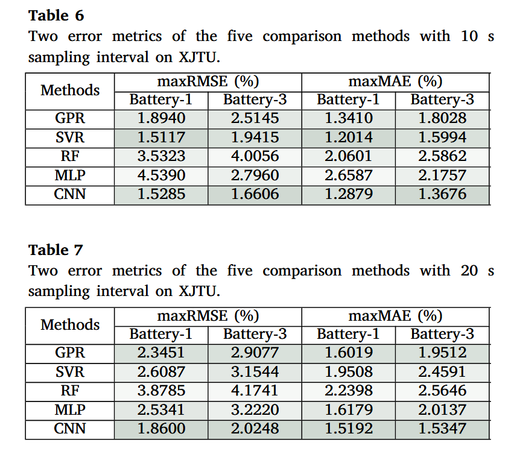

**迁移设定**：
训练集使用 Batch-1 中的 Battery-4、−2。
测试数据包括Batch-2中的Battery-1和Battery-3。
测试集每只电池的前 25% 的数据用于微调。

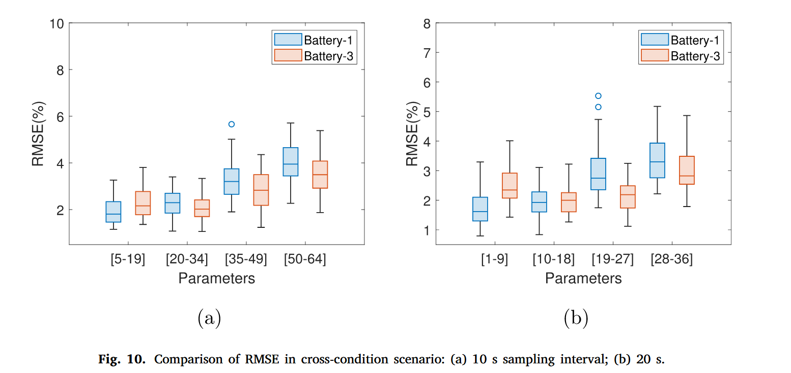

Liu et al. (2026a)

[Liu Y, Xu Y, Liao Z, et al. High-precision battery state-of-health estimation method based on multi-scale gramian matrix entropy and data augmentation[J]. Journal of Energy Storage, 2026, 141: 119595.](https://doi.org/10.1016/j.est.2025.119595)

文章使用了Batch-1的前6个电池来验证提出的方法

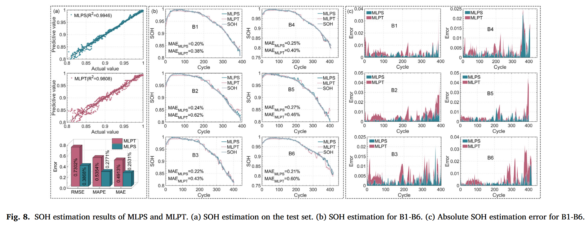

Zhang et al. (2025a)

[Zhang K, Rayeem S K, Mai W, et al. Enhancing battery health estimation using incomplete charging curves and knowledge-guided deep learning[J]. Reliability Engineering & System Safety, 2025, 262: 111211.](https://doi.org/10.1016/j.ress.2025.111211)

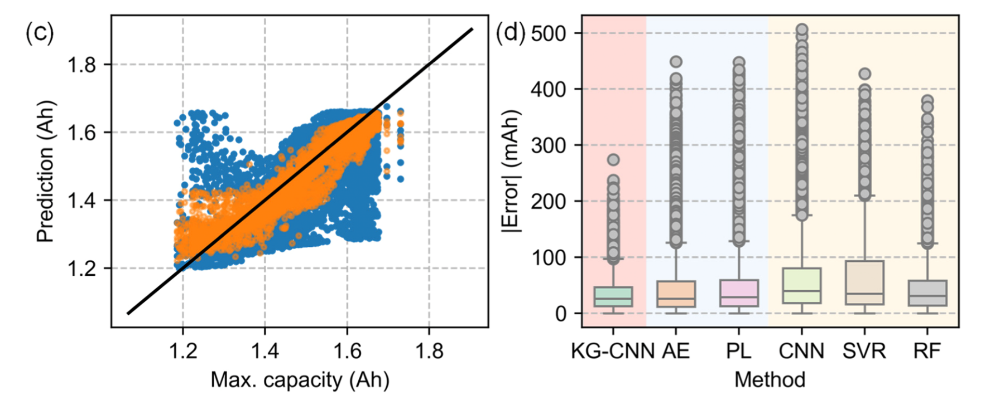

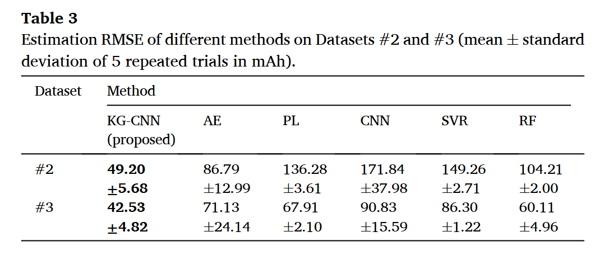

Chen et al. (2026a)

[Chen S, Wei C, Han L, et al. RATGH: state of health estimation of lithium-ion batteries based on ResAttention-Transformer with Gramian hybrid field encoding[J]. Electrical Engineering, 2026, 108(1): 55.](https://link.springer.com/article/10.1007/s00202-025-03350-x)

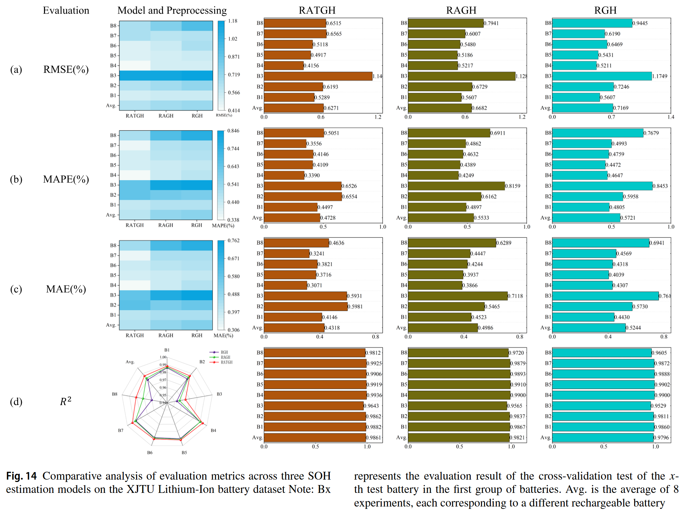

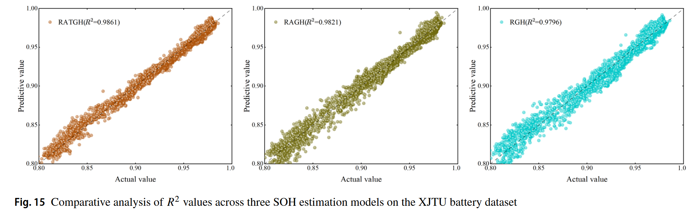

与其他方法对比：

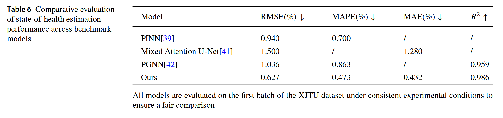

Gui et al. (2026a)

[Gui X, Zhang S, Cheng Y, et al. Fine-Grained Subdomain Alignment and Feature Grouping Based Cross-Domain SOH Estimation for Lithium-Ion Batteries Using a Patch Time Series CNN-Transformer Network[J]. IEEE Transactions on Power Electronics, 2025.](https://ieeexplore.ieee.org/document/11265776)

文章使用Batch-1的前三个电池来验证提出的方法，虽然文章由迁移学习的设定，但是源于和目标域所用的都是同一个Batch的电池。

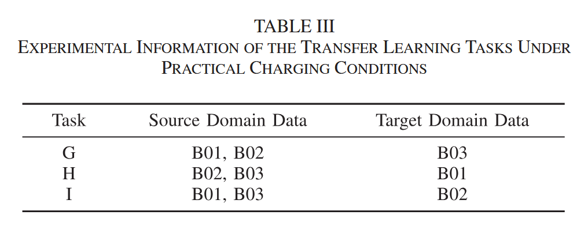

在该数据集上的任务有3个，分别是G/H/I,结果如下：

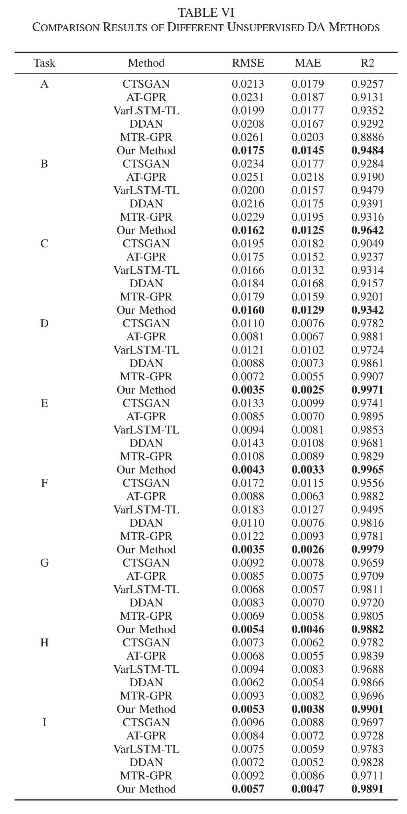

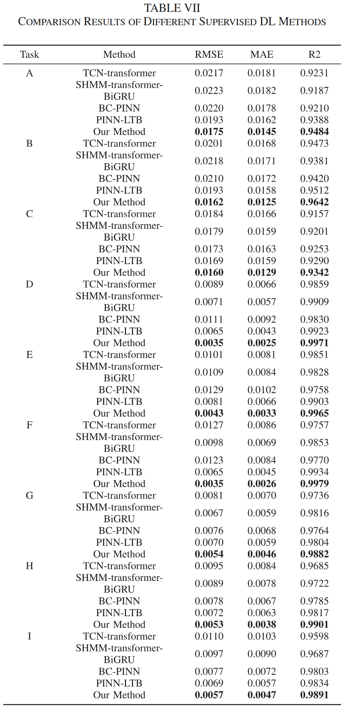

He et al. (2025b)

[He J, Li T, Chen J, et al. An Interpretable Fourier Kolmogorov-Arnold Network for State-of-Health Estimation of Lithium-ion Batteries with Partial Charging Data[C]//2025 IEEE 23rd International Conference on Industrial Informatics (INDIN). IEEE, 2025: 1-6.](https://ieeexplore.ieee.org/document/11278989)

文章提出了FourierKAN方法，结果如下：

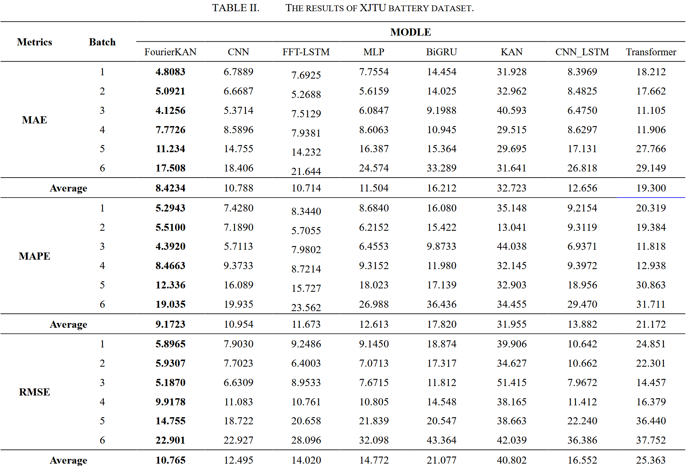

Huang et al. (2025a)

[Huang R, Chen Y, Liu C. Revealing state-feature dependencies in dynamic degradation: an exofeature-aware transformer for battery state-of-health prediction[J]. IEEE Transactions on Consumer Electronics, 2025.](https://ieeexplore.ieee.org/document/11244181)

文章使用了所有的数据来验证提出的方法，结果如下：

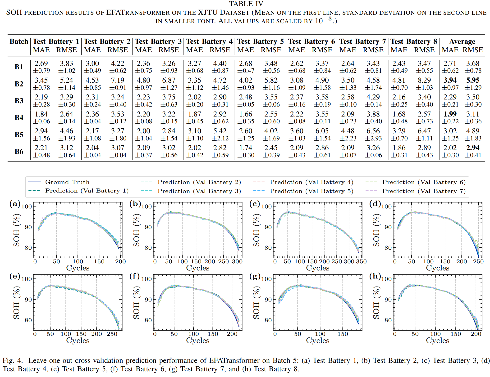

与其他方法的对比：

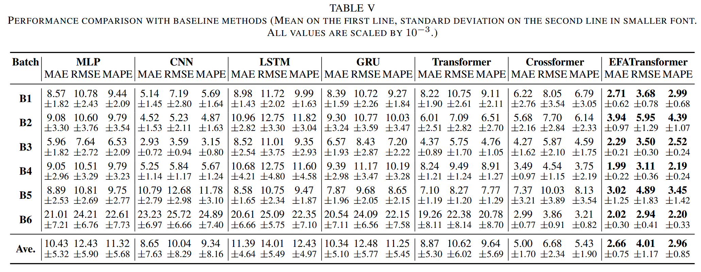

Gao et al. (2025a)

[Gao F, Zhang D, Wang P, et al. State-of-Health Estimation of Lithium-Ion Batteries Using Partial Constant-Voltage Charging Data[C]//2025 5th International Conference on New Energy and Power Engineering (ICNEPE). IEEE, 2025: 976-980.](https://ieeexplore.ieee.org/document/11384461)

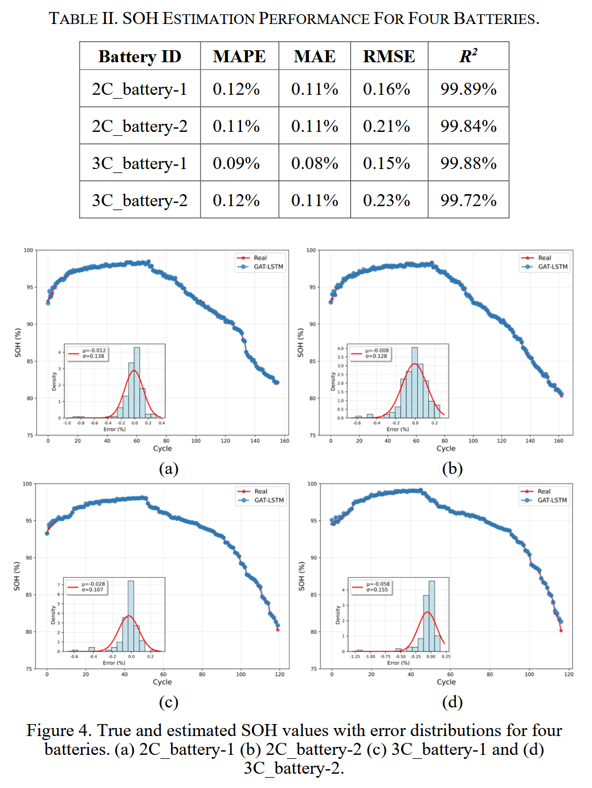

Meng et al. (2025a)

[Meng X, Xu S, Yu Y, et al. Extended long short-term memory network for robust state-of-health estimation of lithium-ion batteries under diverse charging strategies[J]. International Journal of Electrical Power & Energy Systems, 2025, 172: 111146.](https://doi.org/10.1016/j.ijepes.2025.111146)

文章使用Batch-2的15个电池进行验证，结果如下：

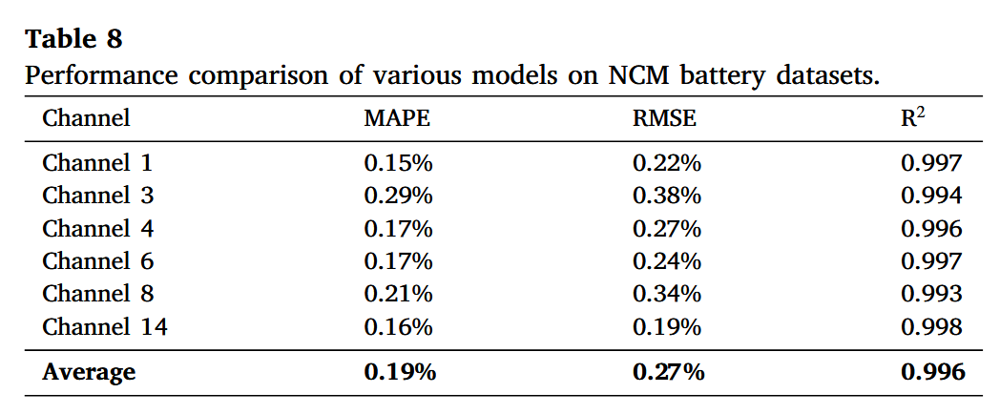

Guo et al. (2025a)

[Guo F, Xu K, Zhang Z, et al. Battery SOH Prediction Under Different Conditions via MBLSTM and Itransformer With Anomaly Detection and Explainability[J]. IEEE Open Journal of the Computer Society, 2025.](https://ieeexplore.ieee.org/document/11217227)

文章提出的方法为MBLSTM+iTransformer，使用的数据如下图所示：

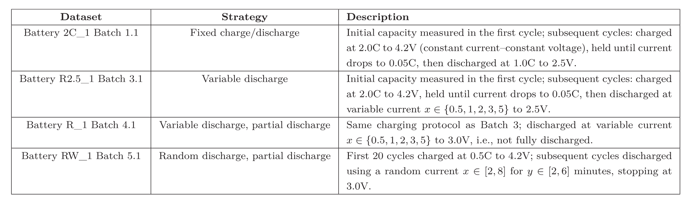

结果如下：

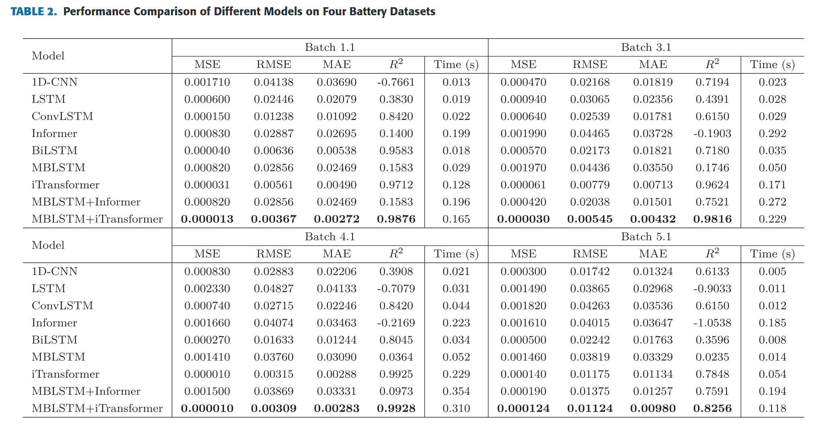

---

# RUL prediction

Feng et al. (2025a)

[Feng H, Xue D. Parallel-branch enhanced ShuffleNet with dual-physics constraints for lithium-ion battery RUL prediction[J]. Journal of Energy Storage, 2025, 118: 116210.](https://doi.org/10.1016/j.est.2025.116210)

文章使用了Batch-1、Batch-3、Batch-4、Batch-5的电池数据来验证提出的ShuffleNet方法。

**详细结果如下**：

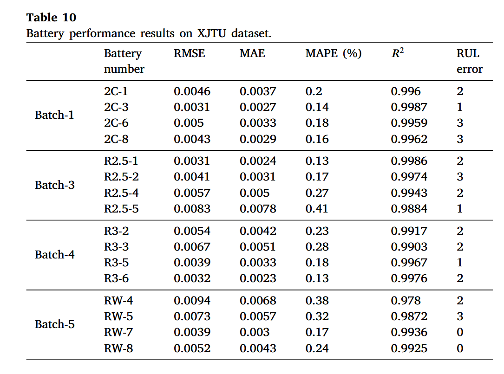

Yang et al. (2025a)

[Yang W, Yang H. Ultra-early prediction of lithium-ion battery cycle life based on assembled capacity curve extracted from a single cycle[J]. Journal of Power Sources, 2025, 640: 236620.](https://doi.org/10.1016/j.jpowsour.2025.236620)

文章从第一个cycle的数据中构造特征来预测RUL，使用了Batch-1和Batch-2的数据，并进行15折交叉验证。

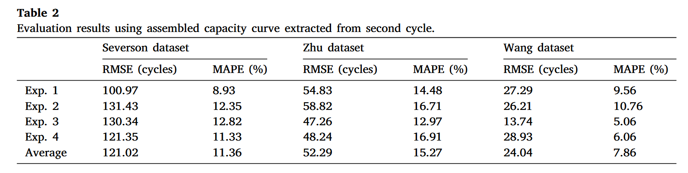

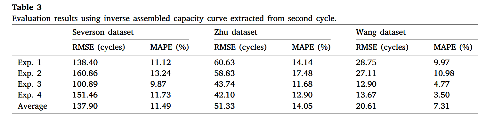

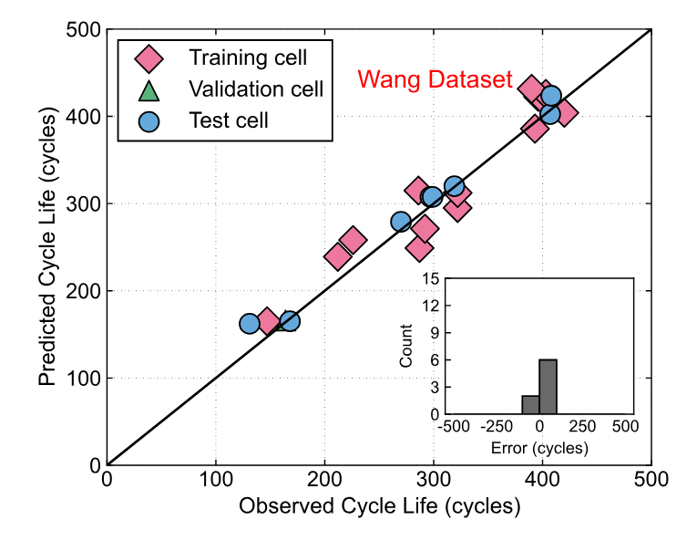

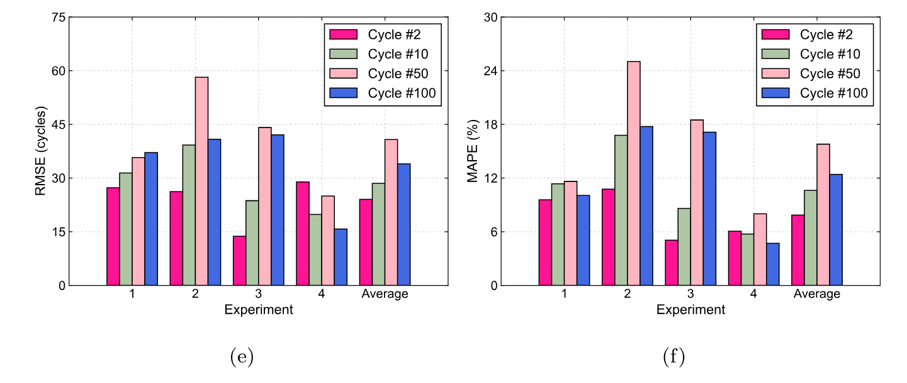

Li et al. (2025a)

[Li H, Wang J, Deng Z, et al. ECA-CNN-Driven RUL Prediction for Lithium-Ion Batteries: A Charging Data Deep Learning Approach[C]//2025 CAA Symposium on Fault Detection, Supervision, and Safety for Technical Processes (SAFEPROCESS). IEEE, 2025: 1-5.](https://ieeexplore.ieee.org/document/11268112)

文章使用Batch-1和Batch-3的数据进行验证。分别用两个批次的第一个电池作为测试集，其他电池作为训练集，利用前N个cycle的数据作为输入来预测RUL，N分别取50,100,200。结果如下：

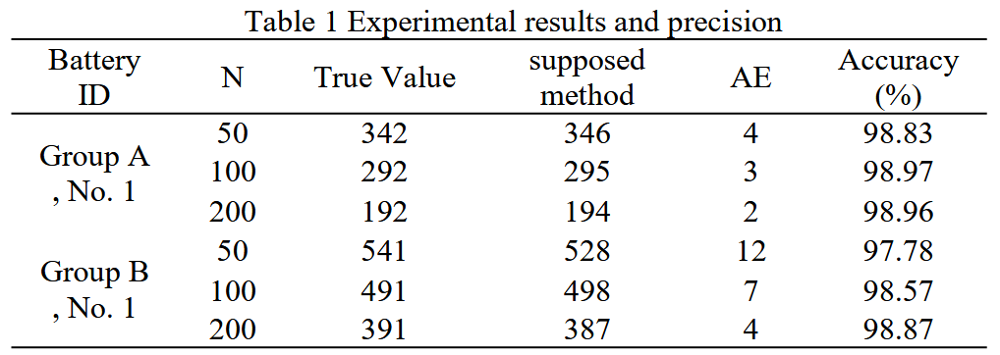

Bi et al. (2026a)

[Bi J, Fei Z, Wang J. Adaptive confidence-calibrated semi-supervised ensemble for early-cycle battery lifetime prediction[J]. Applied Energy, 2026, 409: 127515.](https://doi.org/10.1016/j.apenergy.2026.127515)

文章使用Batch-1, Batch-2, Batch-6的数据来验证提出的方法，利用前100个cycle的数据作为输入来预测RUL。

数据可视化：

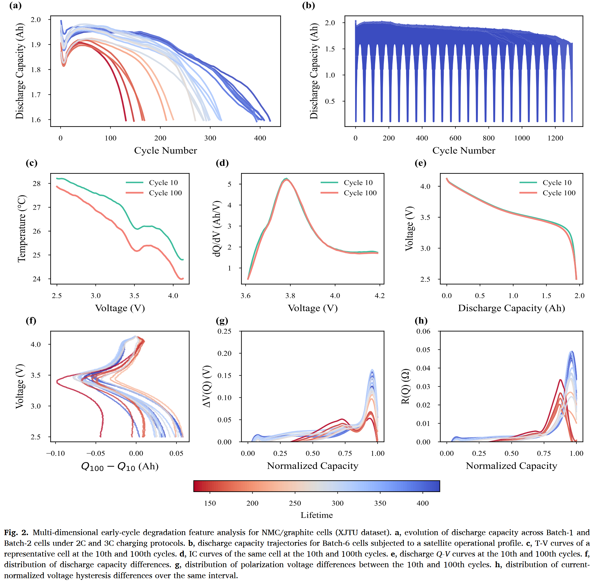

结果：

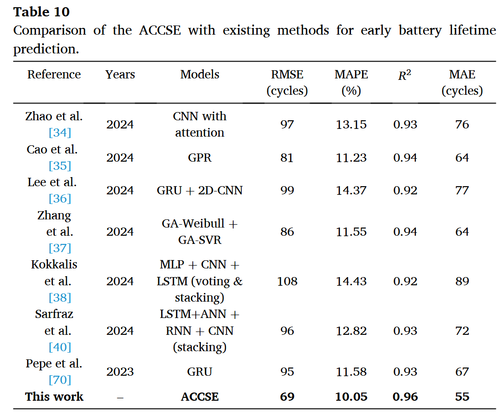

---

# SOC estimation

Wang et al. (2025a)

[Wang X, Yi Y, Yuan Y, et al. Enhanced state of charge estimation in lithium-ion batteries based on Time-Frequency-Net with time-domain and frequency-domain features[J]. Energy, 2025: 134722.](https://doi.org/10.1016/j.energy.2025.134722)

文章使用了Batch-1和Batch-3的电池数据来验证提出的TFN方法。
任务是SOC估计；

**Batch-3结果可视化**：

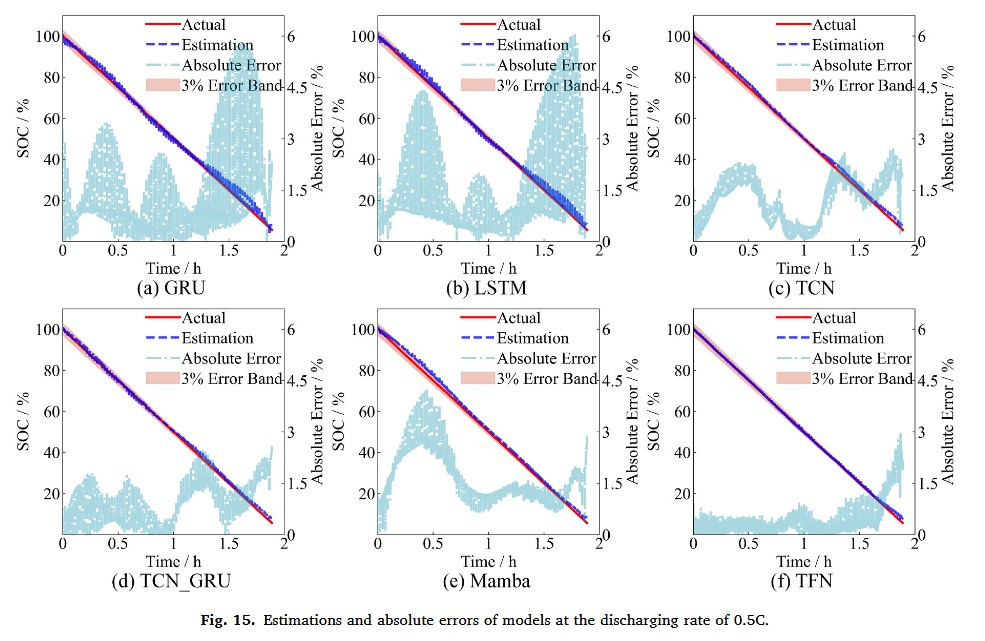

Batch-3结果表格：

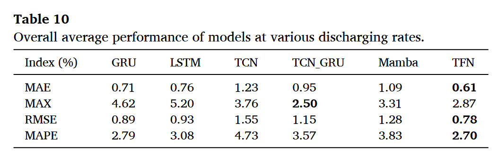

Batch-1结果表格：

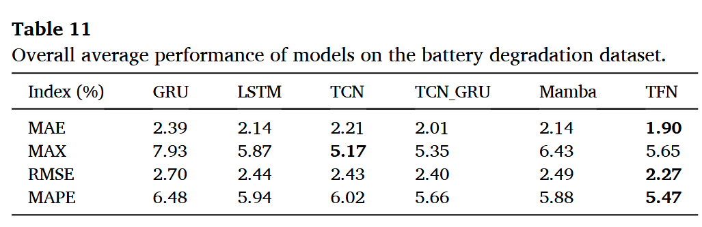

---

# 其他任务

Tang et al. (2024a)

[Tang A, Xu Y, Tian J, et al. Physics-informed battery degradation prediction: Forecasting charging curves using one-cycle data[J]. Journal of Energy Chemistry, 2024.](https://doi.org/10.1016/j.jechem.2024.10.018)

文章所做的任务是预测充电曲线，用一个cycle的CC阶段的V-Q预测来预测未来多个cycle的V-Q曲线。
用了Batch-1和Batch-2的数据来验证。
每个Batch中，电池#1，#3，#4，#5，#6，#7的数据用来训练，#2，#8的数据用来测试。
预测长度为150个cycle。

**结果可视化**：

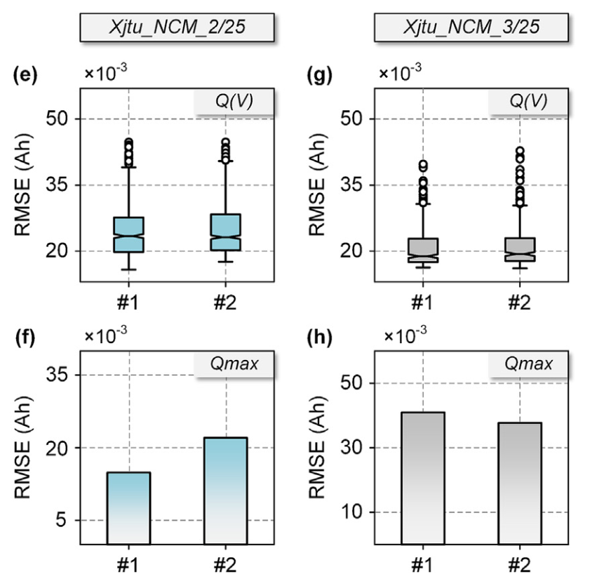

 Tang et al. (2024b) 

[Tang A, Xu Y, Liu P, et al. Deep learning driven battery voltage-capacity curve prediction utilizing short-term relaxation voltage[J]. eTransportation, 2024: 100378.](https://doi.org/10.1016/j.etran.2024.100378)

文章利用驰豫电压曲线来预测V-Q曲线，用了Batch-1和Batch-2的数据来验证。

注意，文章只给出了`最大RMSE`的值，分别为0.046和0.055，并没有给出平均值。

**结果可视化**：

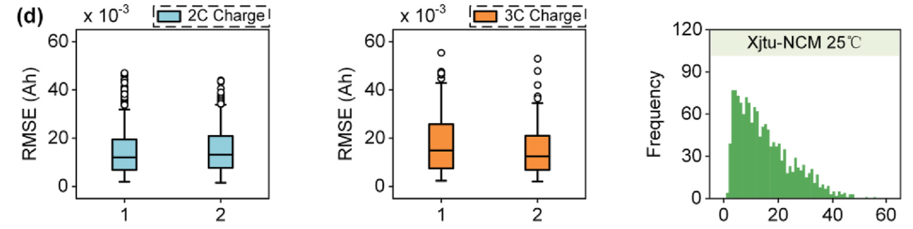

