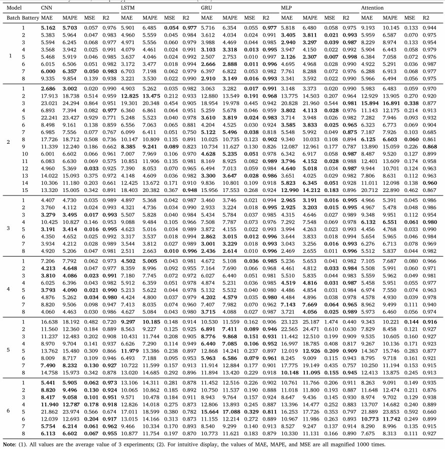

# Articles Using XJTU Battery Dataset: Compilation and Summary

> **Objective:** This document compiles and summarizes articles that utilize the `XJTU battery dataset`, providing detailed records of the results reported in these articles. This is intended to facilitate direct comparison for future works using the same dataset.

Chinese document:

Last updated🕒: 2024-07-27 😀😀😀  

**Dataset Links:**
- [GitHub](https://wang-fujin.github.io/)
- 

**Data Description and Preprocessing Code:**
https://github.com/wang-fujin/Battery-dataset-preprocessing-code-library

**Please cite our paper if you use this dataset:**

[Wang F, Zhai Z, Zhao Z, et al. Physics-informed neural network for lithium-ion battery degradation stable modeling and prognosis[J]. Nature Communications, 2024, 15(1): 4332.](https://www.nature.com/articles/s41467-024-48779-z)

## Data Summary

> The `XJTU battery dataset` comprises 6 batches with a total of 55 batteries. Not all articles use all batteries, so a shorthand is defined to indicate which batteries are used in the articles, formatted as `Bxby`.
> - `Bx` denotes the x-th batch;
> - `by` denotes the y-th battery in that batch;
> - `All` indicates all batteries.
> 
> Examples:
> - `B1b1` indicates the 1st battery in the 1st batch;
> - `B1` indicates all batteries in the 1st batch;
> - `B2b1-b4` indicates the 1st to 4th batteries in the 2nd batch.

> We categorize the training and testing modes (Mode) in the articles into two types:
> - Type 1: Training and testing on the same battery, using early data for training and later data for testing. This mode is noted as `Train A and Test A`, abbreviated as `AA`.
> - Type 2: Training and testing on different batteries, noted as `Train A and Test B`, abbreviated as `AB`.

---

### Summary of SOH Estimation Results
| Battery |   Model Name   | Mode |    MSE     |  RMSE   |  MAE   |    MAPE     | R2 |             Details             | Paper Link | Non-transfer learning | Transfer learning |
|:-------:|:--------------:|:----:|:----------:|:-------:|:------:|:-----------:|:-------------:|:-------------------------------:|:-----:|:-----:|:-----:|
| `B1b1`  |  HHO-LSTM-FC   | `AA` |     -      | 0.0078  | 0.0065 |      -      |    0.9422     | [Yang et al. (2024)](#yang2024) | [link](https://www.mdpi.com/2071-1050/16/15/6316) | ✅ | ✅  |
|  `All`  |    CNN[^1]     | `AB` |  0.000161  | -       | 0.0085 |   0.00926   |    0.9187     | [Wang et al. (2024)](#wang2024) | [link](https://www.sciencedirect.com/science/article/pii/S2352152X23032826?via%3Dihub) | ✅ | ❌  |
|  `All`  |    LSTM[^1]    | `AB` |  0.000117  | -       | 0.0079 |   0.00861   |    0.9407     | [Wang et al. (2024)](#wang2024) | [link](https://www.sciencedirect.com/science/article/pii/S2352152X23032826?via%3Dihub) | ✅ | ❌  |
|  `All`  |    GRU[^1]     | `AB` | 0.0000983  | -       | 0.0071 |   0.00776   |    0.9503     | [Wang et al. (2024)](#wang2024) | [link](https://www.sciencedirect.com/science/article/pii/S2352152X23032826?via%3Dihub) | ✅ | ❌  |
|  `All`  |    MLP[^1]     | `AB` |  0.000139  | -       | 0.0078 |   0.00844   |    0.9331     | [Wang et al. (2024)](#wang2024) | [link](https://www.sciencedirect.com/science/article/pii/S2352152X23032826?via%3Dihub) | ✅ | ❌  |
|  `All`  | Attention[^1]  | `AB` |  0.000135  | -       | 0.0087 |   0.00950   |    0.9317     | [Wang et al. (2024)](#wang2024) | [link](https://www.sciencedirect.com/science/article/pii/S2352152X23032826?via%3Dihub) | ✅ | ❌  |

[^1]: The MSE, RMSE, MAE, and MAPE values in the table are averages across all batteries.

---

### Summary of RUL Prediction Results
| Battery |   Model Name   | Mode |    MSE     |  RMSE   |  MAE   |    MAPE     | R2 |             Details             | Paper Link | Non-transfer learning | Transfer learning |
|:-------:|:--------------:|:----:|:----------:|:-------:|:------:|:-----------:|:-------------:|:-------------------------------:|:-----:|:-----:|:-----:|

---

# SOH Estimation

 

Yang et al. (2024)

[Yang G, Wang X, Li R, et al. State of Health Estimation for Lithium-Ion Batteries Based on Transferable Long Short-Term Memory Optimized Using Harris Hawk Algorithm[J]. Sustainability, 2024, 16(15): 6316.](https://www.mdpi.com/2071-1050/16/15/6316)

Used only the 1st battery of Batch-1, noted as `B1b1`.

The article implemented two SOH estimation modes:
1. Pre-training on NASA's B6 and B7 batteries, then fine-tuning with the first 30% data of `B1b1`, followed by testing on `B1b1`.
2. Training with the first 70% data of `B1b1`, followed by testing on `B1b1`.

Results:

|                    | RMSE   | MAE    | R2 | Mode  |
| ------------------ | ------ | ------ | ------------- | ---  |
| HHO-LSTM-FC-TL(B6) | 0.0037 | 0.0029 | 0.9941        | 1    |
| HHO-LSTM-FC-TL(B7) | 0.0034 | 0.0027 | 0.9952        | 1    |
| HHO-LSTM-FC        | 0.0078 | 0.0065 | 0.9422        | 2    |

Wang et al. (2024)

[Wang F, Zhai Z, Liu B, et al. Open access dataset, code library and benchmarking deep learning approaches for state-of-health estimation of lithium-ion batteries[J]. Journal of Energy Storage, 2024, 77: 109884.](https://www.sciencedirect.com/science/article/pii/S2352152X23032826?via%3Dihub)

In this article, we provide a benchmark testing five deep learning models on three types of inputs (`all charging data`, `partial charging data`, `features`) and under three normalization methods.

The above image shows the results of the five models using `features` as input and `[-1,1] normalization`, with all results magnified by 1000 times. Due to the abundance of results, we only show one type here; other results can be found in the original paper.

---

# RUL Prediction

